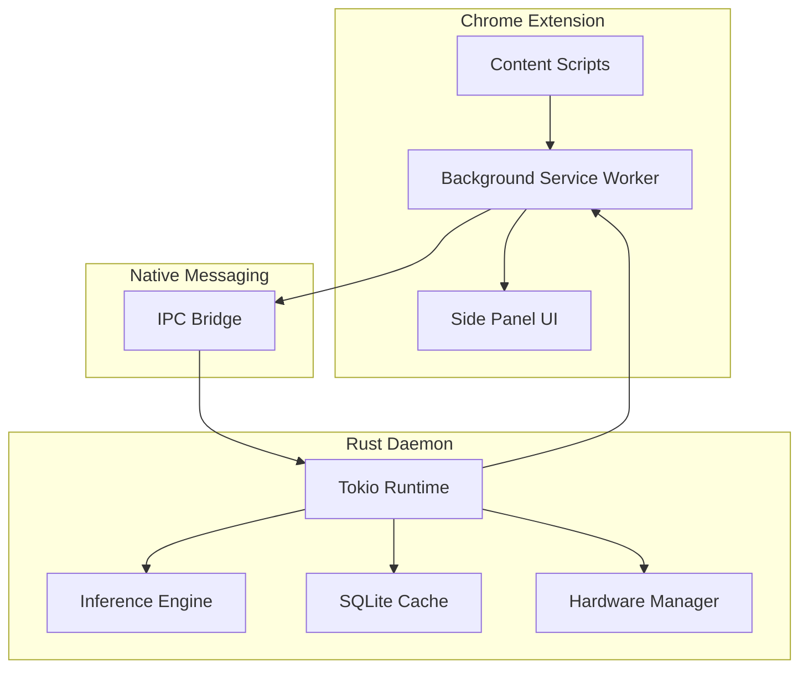

# Ssense

> Privacy-first edge intelligence for privacy policy analysis and browser-side privacy enforcement.

Ssense is an edge-native privacy platform that combines local AI analysis with browser-side privacy controls to help users understand data collection practices and reduce exposure to common tracking techniques.

The system operates primarily on-device, using a local inference engine and a Chrome extension connected through Native Messaging. Privacy policies can be analyzed without sending page content to external AI services, and browser APIs commonly used for fingerprinting can be monitored or modified through extension-based controls.

---

## Features

### Local AI Policy Analysis

* On-device privacy policy auditing
* Structured compliance reports
* JSON-schema-driven output validation
* No dependency on cloud-based LLM APIs

### Browser Privacy Enforcement

* Detection of common tracking patterns
* Browser fingerprinting mitigation
* DOM-based privacy interventions
* Real-time policy evaluation

### Native Runtime

* Rust-based native daemon
* Native Messaging integration
* SQLite caching layer
* Hardware-aware model management

### Performance

* Asynchronous processing pipeline
* Deduplicated audit requests
* Local result caching
* Resource-aware inference execution

---

## Architecture



---

## Repository Structure

```text
ssense/
├── apps/
│   ├── extension/
│   └── native-daemon/
│
├── libs/
│   ├── contracts/
│   └── rust-utils/
│
├── docs/
├── scripts/
├── ml/
└── Makefile
```

---

## Prerequisites

### Runtime

* Rust 1.75+
* Node.js 18+
* Google Chrome (latest stable)
* 64-bit operating system

### Recommended Hardware

* 16 GB RAM minimum
* 32 GB RAM recommended for larger local models
* Modern multi-core CPU

---

## Installation

### Clone

```bash
git clone https://github.com/your-org/ssense.git
cd ssense
```

### Build Extension

```bash
make build-ext
```

### Build Native Daemon

```bash
make build-daemon
```

### Load Extension

1. Open `chrome://extensions`
2. Enable Developer Mode
3. Click **Load Unpacked**
4. Select:

```text
apps/extension/dist
```

### Register Native Messaging Host

```bash
node scripts/register-nmh.js <EXTENSION_ID>
```

---

## Development

### Run Tests

```bash
make test
```

### Lint

```bash
make lint
```

### Format

```bash
make fmt
```

---

## Security Model

Ssense is designed around three principles:

1. **Local Processing** – Privacy analysis is performed on-device whenever possible.
2. **Least Privilege** – Browser and native components communicate through a constrained IPC interface.
3. **Defense in Depth** – Tracking mitigation combines API-level controls, DOM analysis, and policy auditing.

No software can guarantee complete anonymity or block every tracking technique. Ssense aims to reduce exposure to common tracking mechanisms while providing transparency into privacy practices.

---

## Disclaimer

Privacy policy analysis generated by AI should be treated as informational assistance and not as legal advice.

Users should consult qualified legal professionals for regulatory or compliance decisions.

---

## License

Apache-2.0 License
