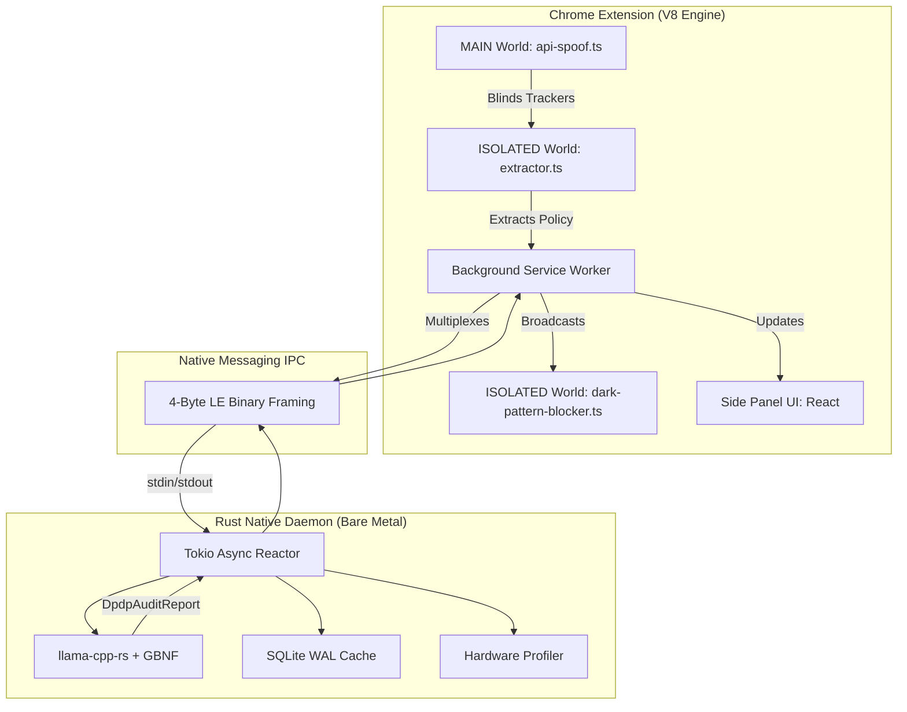

# Ssense

> **Zero-Knowledge Edge AI for Privacy Policy Analysis and Browser-Side Enforcement.**

Ssense is a production-grade, edge-native privacy platform that combines local AI analysis with browser-side privacy controls to help users understand data collection practices and reduce exposure to enterprise-grade tracking techniques. 

Unlike traditional cloud-based privacy tools, Ssense operates entirely on the edge. It utilizes a local 9-billion parameter Large Language Model running via a bare-metal Rust Native Daemon to audit privacy policies in milliseconds, and injects stealth rootkits into the browser's `MAIN` world to blind hardware fingerprinting scripts before they execute.

**Core Value Proposition:**
* **For Users:** Absolute privacy, zero latency, and an invisible shield against tracking and dark patterns.
* **For Enterprise/Regulators:** Deterministic, mathematically guaranteed enforcement of the DPDP Act 2023 at the network layer.
* **For Engineering:** A modular, crash-resilient architecture bridging V8 JavaScript, Rust, and C++ tensor math.

---

## 🛡️ Key Features

### Edge AI Policy Analysis
* **On-Device Inference:** Audits privacy policies locally using a quantized 9B parameter model (Qwen 2.5 9B Q4_K_M).
* **Deterministic Output:** Uses GBNF (GPT-BNF) grammar to physically constrain the C++ tensor engine, guaranteeing 100% valid JSON schema compliance with zero parsing failures.
* **Zero-Knowledge:** No browsing data, policy text, or audit reports ever leave the machine.

### Preemptive Privacy Enforcement
* **MAIN World API Spoofing:** Injects stealth Proxies at `document_start` to override `HTMLCanvasElement`, `WebGLRenderingContext`, `AudioContext`, and `Navigator.hardwareConcurrency`.
* **Anti-Detection:** Uses a Singleton `WeakSet` registry to mask Proxies as `[native code]`, defeating elite fingerprinting libraries like FingerprintJS v4.
* **Real-Time DOM Intervention:** Utilizes a highly-optimized `MutationObserver` to physically collapse third-party trackers to 0 dimensions without triggering Cumulative Layout Shift (CLS).

### Native Runtime & IPC
* **Rust Native Daemon:** Bare-metal execution via `llama-cpp-rs` and Tokio, ensuring zero Garbage Collector pauses and memory safety.
* **Binary IPC Bridge:** Communicates with the Chrome Extension via a 4-Byte Little-Endian binary framing protocol over Native Messaging, featuring bilateral timeouts and zombie process prevention.
* **Hardware-Aware:** Dynamically profiles CPU cores, VRAM, and Linux cgroup limits to prevent OS-level Out-Of-Memory (OOM) crashes.

### Agentic UX
* **Context-Aware Co-Pilot:** A glassmorphic Side Panel UI where users can interrogate the privacy policy. The AI answers *strictly* grounded in the cached audit report, preventing hallucinations.
* **Autonomous Loop:** Extracts, audits, caches, and enforces without requiring user intervention.

---

## 🏗️ Architecture

Ssense bridges the sandboxed Chrome V8 engine with bare-metal OS execution via Native Messaging.


```mermaid
graph TD
    subgraph "Chrome Extension (V8 Engine)"
        A1[MAIN World: api-spoof.ts]
        A2[ISOLATED World: extractor.ts]
        A3[ISOLATED World: dark-pattern-blocker.ts]
        B[Background Service Worker]
        C[Side Panel UI: React]
    end

    subgraph "Native Messaging IPC"
        D[4-Byte LE Binary Framing]
    end

    subgraph "Rust Native Daemon (Bare Metal)"
        E[Tokio Async Reactor]
        F[llama-cpp-rs + GBNF]
        G[SQLite WAL Cache]
        H[Hardware Profiler]
    end

    A1 -->|Blinds Trackers| A2
    A2 -->|Extracts Policy| B
    B -->|Multiplexes| D
    D -->|stdin/stdout| E
    E --> F
    E --> G
    E --> H
    F -->|DpdpAuditReport| E
    E --> D
    D --> B
    B -->|Broadcasts| A3
    B -->|Updates| C
```

### The Agentic Workflow
1. **Preemptive Strike (`document_start`):** `api-spoof.ts` runs in the MAIN world, blinding Canvas/WebGL fingerprinters before the page's JavaScript loads.
2. **Extraction (`document_idle`):** `extractor.ts` fetches the privacy policy via a CORS-bypassing Service Worker proxy and truncates it to 16,000 characters.
3. **Edge Inference:** The Rust Daemon checks the SQLite cache. On a miss, it acquires a Global Mutex, runs the LLM constrained by the GBNF grammar, and saves the result.
4. **DOM Enforcement:** The audit report is broadcast back to Chrome, where `dark-pattern-blocker.ts` physically collapses offending trackers.

---

## 📂 Repository Structure

```text
ssense/
├── .github/workflows/        # CI/CD pipelines
├── apps/
│   ├── extension/            # Chrome MV3 Extension (React + TypeScript)
│   │   ├── public/           # manifest.json, icons, content.css
│   │   └── src/
│   │       ├── background/   # Service Worker & Native Messaging Bridge
│   │       ├── content/      # DOM Enforcer, Extractor, MAIN world API Spoofer
│   │       ├── sidebar/      # Glassmorphic Co-Pilot UI
│   │       └── types/        # Shared TypeScript interfaces
│   │
│   └── native-daemon/        # Rust Edge AI Engine
│       ├── src/
│       │   ├── cache/        # SQLite WAL Memory Layer
│       │   ├── inference/    # llama-cpp-rs, GBNF Grammar, Hardware Profiler
│       │   ├── messaging/    # LittleEndian Binary Framing
│       │   ├── main.rs       # Tokio Async Multiplexer
│       │   └── model_manager.rs # Auto-downloader & SHA-256 Verifier
│       └── Cargo.toml
│
├── docs/
│   ├── ARCHITECTURE.md       # ML Data Forge & Training Pipeline (vLLM/Unsloth)
│   └── BUILD.md              # Deployment, UX, and Threat Model specifications
│
├── libs/
│   ├── contracts/            # Single Source of Truth (JSON Schemas, Prompts)
│   └── rust-utils/           # Shared Workspace Utilities (Hashing, Normalization)
│
├── ml/                       # Python Training Forge (GAN Data Synthesis)
│   ├── data-forge/           # Scrapers & 72B Teacher Synthesizer
│   ├── evals/                # Accuracy & Grammar testing
│   └── slm-training/         # Unsloth SFT/DPO scripts for 9B Student
│
├── scripts/
│   └── register-nmh.js       # Cross-platform Native Messaging Host registrar
│
└── Makefile                  # POSIX-compliant Build Orchestrator
```

---

## 🚀 Prerequisites & Installation

### Prerequisites
* **Rust Toolchain:** `rustc 1.75+` (with `cargo`)
* **Node.js:** `v18+` (with `npm`)
* **Google Chrome:** Latest stable build
* **OS:** Windows 10/11, macOS, or Linux (64-bit required for `mmap`)

### Recommended Hardware
| Component | Minimum | Recommended |
| :--- | :--- | :--- |
| **GPU** | None (CPU fallback) | 6GB VRAM (for Q4_K_M quantization) |
| **RAM** | 8GB System RAM | 16GB+ System RAM |
| **Storage** | 10GB | 20GB (for model weights + cache) |

### Build & Install Workflow

1. **Clone the repository:**
   ```bash
   git clone https://github.com/your-org/ssense.git
   cd ssense
   ```

2. **Compile the entire stack (Extension + Rust Daemon):**
   ```bash
   make build-ext
   make build-daemon
   ```

3. **Load the Extension in Chrome:**
   * Navigate to `chrome://extensions`
   * Enable **Developer Mode**
   * Click **Load Unpacked** and select the `apps/extension/dist` directory
   * Copy the generated **Extension ID** (e.g., `abcdefghijklmnop`)

4. **Register the Native Messaging Host:**
   ```bash
   # The script handles Windows Registry, macOS, and Linux paths automatically
   node scripts/register-nmh.js <YOUR_EXTENSION_ID>
   ```

5. **Run the test suite:**
   ```bash
   make test
   ```

---

## 🔐 Security Model & Threat Mitigation

Ssense is designed around three principles:

1. **Local Processing (Zero-Knowledge):** Privacy analysis and inference happen entirely on-device. No external API calls or telemetry.
2. **Least Privilege IPC:** Browser and native components communicate through a constrained, timeout-hardened binary IPC interface with strict payload size limits (10MB max).
3. **Defense in Depth:** Tracking mitigation combines API-level controls (MAIN world spoofing), DOM analysis (MutationObserver), and policy auditing (Edge AI).

### Threat Model
| Threat Vector | Mitigation Strategy |
| :--- | :--- |
| **Elite Fingerprinting** | `api-spoof.ts` masks Proxies as `[native code]` via a Singleton `WeakSet`, defeating `.toString()` detection. |
| **Clean Room Iframes** | Hooks `Node.prototype.appendChild` and `contentWindow` getters to recursively poison iframe environments. |
| **LLM Hallucinations** | GBNF grammar compiles the schema into an FSM. The C++ backend physically masks invalid logits *during sampling*. |
| **OS OOM Kills** | `hardware_profiler.rs` reads Linux cgroup limits and asserts 64-bit architecture before loading the model. |

---

## 📚 Documentation

* **[Architecture & ML Pipeline](docs/ARCHITECTURE.md):** Deep dive into the GAN Forge, vLLM data generation, Unsloth training, and DGX hardware orchestration.
* **[Build & Deployment Blueprint](docs/BUILD.md):** Detailed UX flows, agentic workflow diagrams, and edge vs. cloud orchestration logic.

---

## ⚖️ Disclaimer

Privacy policy analysis generated by AI should be treated as informational assistance and not as legal advice. Users should consult qualified legal professionals for regulatory or compliance decisions regarding the DPDP Act 2023 or other privacy regulations.

---

## 📄 License

Licensed under the [Apache-2.0 License](LICENSE).