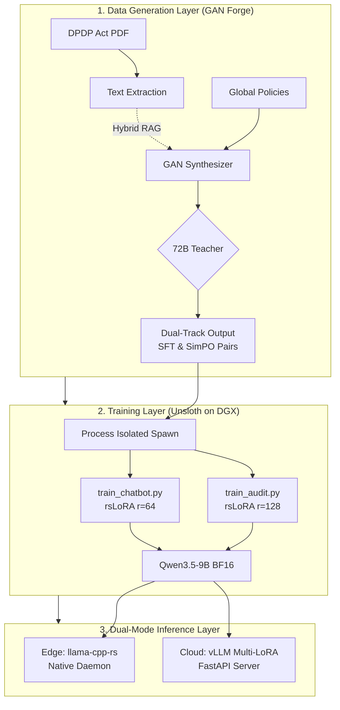
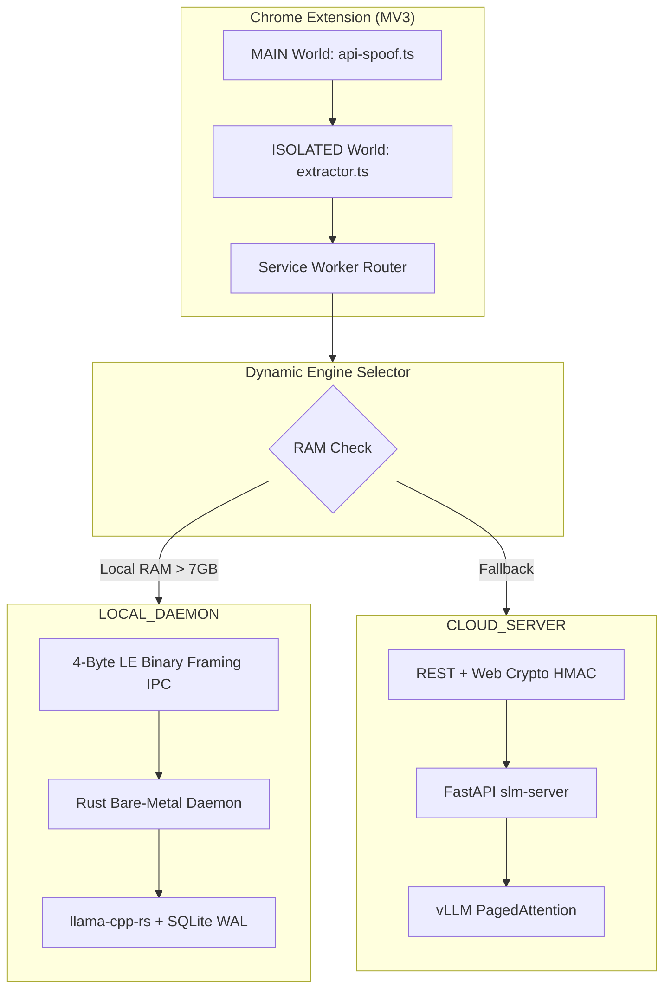

# Ssense DPDP Compliance Engine - Architecture Documentation

## 🎯 Executive Summary

The Ssense DPDP Compliance Engine is a production-grade privacy policy audit system that combines adversarial data generation, efficient fine-tuning, and deterministic inference to enforce India's Digital Personal Data Protection (DPDP) Act 2023 in real-time at the network layer.

**Core Innovation:** A closed-loop GAN (Generative Adversarial Network) forge that uses a 72B teacher model to synthesize legally-grounded training data, which is then distilled into a 9B student model capable of running locally on consumer hardware with <100ms latency, or seamlessly failing over to a high-concurrency cloud orchestrator.

---

## 🏗️ System Architecture Overview

---

## 📊 Technology Stack & Rationale

### Core Infrastructure

| Component | Technology | Version | Rationale |
|-----------|-----------|---------|-----------|
| **Base Model** | Qwen3.5-9B | 2026 | Optimal balance: 9B parameters fit in 18GB VRAM, strong multilingual reasoning, excellent instruction following |
| **Training Framework** | Unsloth | Latest | 2× faster training, 60% less VRAM, custom Triton kernels for LoRA, exact 32-bit `adamw_torch` variance tracking |
| **Data Generation** | vLLM | 0.24.0 | Production-grade inference engine with structured output enforcement and PagedAttention |
| **Inference Backend** | `llama-cpp-rs` / `vLLM` | Latest | Dual-Mode Engine: Bare-metal Rust (`llama-cpp-rs` via Little-Endian IPC) on edge + FastAPI `vLLM` Virtual SLM Server (`apps/slm-server`) |
| **Hardware** | NVIDIA DGX Spark | GB10 | 128GB unified memory, Blackwell FP4 tensor cores, 273 GB/s bandwidth |

### Training Stack

| Library | Version | Purpose | Why This Specific Choice |
|---------|---------|---------|-------------------------|
| **transformers** | 5.5.3 | Base model loading | Industry standard, Hugging Face ecosystem integration |
| **trl** | 0.17.0+ | SFTTrainer, DPOTrainer / SimPO | Native support for conversational SimPO length-normalized preference optimization |
| **peft** | 0.16.0+ | Rank-Stabilized LoRA (`rsLoRA`) adapters | Stabilizes high-rank ($r=128$/$r=64$) projections via $1/\sqrt{r}$ scaling |
| **datasets** | 4.3.0 | Data loading | Streaming support, memory-efficient for large datasets |
| **accelerate** | 1.6.0 | Distributed training | Seamless multi-GPU scaling and process isolation (`spawn`) |
| **bitsandbytes** | 0.46.0 | 8-bit optimizers | Memory reduction (we prioritize exact 32-bit `adamw_torch` precision over quantization) |

### Data Generation Stack

| Library | Version | Purpose | Why This Specific Choice |
|---------|---------|---------|-------------------------|
| **vllm** | 0.24.0 | High-throughput inference | PagedAttention, continuous batching, 24× faster than HuggingFace |
| **xgrammar** | Latest | JSON schema enforcement | Finite State Machine (FSM) for guaranteed structural compliance |
| **PyMuPDF** | Latest | PDF text extraction | Fastest PDF parser, handles complex layouts |
| **jsonschema** | Latest | Schema validation | Draft-07 compliance, detailed error reporting |

### Inference Stack

| Library | Version | Purpose | Why This Specific Choice |
|---------|---------|---------|-------------------------|
| **backend_loader.py** | Universal | Multi-backend bridge | Dynamically loads Unsloth (in-memory fast eval), vLLM (multi-LoRA serving), or llama.cpp (GGUF) |
| **verify.py & 5 Pillars** | Universal Suite | 13 Certification Gates | Evaluates schema compliance, F1 accuracy, trust score calibration, red-team traps, and 4 security vectors |
| **llama-cpp-rs** | Latest | Bare-metal GGUF inference | Zero-copy Rust bindings, GBNF grammar-constrained decoding over 4-Byte Little-Endian IPC framing |
| **Chrome MV3 + Native Messaging** | MV3 + NMH | Edge network & DOM interception | MAIN world API spoofing, MutationObserver active `el.remove()` enforcement, binary IPC to Rust daemon |

---

## 🎨 Why vLLM + Unsloth? The Critical Combo

### The Problem with Standard Transformers
Standard Hugging Face Transformers training is **slow and memory-hungry**:
- **Naive attention:** O(n²) memory for sequence length n
- **Redundant computation:** Recomputes activations during backward pass
- **No kernel fusion:** Separate CUDA kernels for each operation
- **Generic optimizer:** FP32 AdamW states consume 4× model size in VRAM

**Result:** Training a 9B model with standard Transformers requires ~80GB VRAM and takes 3× longer.

### The Unsloth Solution
Unsloth is a **training acceleration library** that replaces key components of the Transformers training loop with optimized Triton kernels:

#### 1. Custom FlashAttention Implementation
- **Standard:** PyTorch's SDPA (Scaled Dot-Product Attention)
- **Unsloth:** Custom Triton kernel with tiled matrix multiplication, online softmax, and FP16 accumulation with FP32 reduction.
- **Benefit:** 30% faster attention, 40% less VRAM

#### 2. Fused LoRA Kernels
- **Standard:** Separate matmul for base model + LoRA adapters
- **Unsloth:** Single fused kernel that loads base weights once and applies LoRA delta in the same pass, avoiding intermediate tensor allocations.
- **Benefit:** 2× faster forward/backward pass

#### 3. Optimized Gradient Checkpointing & Process Isolation
- **Standard:** PyTorch's `torch.utils.checkpoint` saves all activations, leading to CUDA memory fragmentation.
- **Ssense Solution:** Selective checkpointing combined with OS-level `multiprocessing spawn`. Once a phase (like SFT) completes, the Linux kernel terminates the process, physically flushing the CUDA context to deliver pristine VRAM for the SimPO phase.
- **Benefit:** 20% less VRAM, zero memory leaks.

### Why vLLM for Data Generation?
vLLM is the **production-grade inference engine** that solves the "data generation bottleneck":
- **PagedAttention:** Virtual memory management for KV cache, reducing fragmentation from 60% to <4%
- **Continuous Batching:** Dynamically batches incoming requests without waiting for long sequences
- **XGrammar Integration:** Compiles JSON schemas into an FSM, enforcing schema compliance at the token sampling level

**Result:** Generates 10,000+ high-quality synthetic training pairs across Track 1 (`audit`) and Track 2 (`chatbot`) in hours instead of days.

---

## 🔧 Optimization Intent & Rationale

### Data Generation Optimizations

| Optimization | Intent | Impact | Trade-off |
|--------------|--------|--------|-----------|
| **Dynamic Context Injection** | Prevent "Lost in the Middle" attention dilution | Model focuses on relevant law sections, 40% better violation detection | Loses global context (acceptable - violations are section-specific) |
| **Hybrid RAG Seeding** | Ground 72B Teacher in DPDP law prior to generation | Zero hallucination of foreign laws (GDPR/CCPA) during synthetic creation | Requires high-speed offline Qdrant indexing |
| **Chunked Prefill** | Flatten VRAM spikes during 35k token prefill | Prevents OOM on DGX Spark unified memory | +5ms latency overhead (negligible) |
| **Prefix Caching** | Eliminate redundant computation for shared prompts | 95% faster batch processing | Requires identical prompt prefixes (enforced by design) |

### Training Optimizations

| Optimization | Intent | Impact | Trade-off |
|--------------|--------|--------|-----------|
| **Dual-Track rsLoRA Strategy** | Isolate strict JSON auditing from conversational chat | Auditor gets $r=128$ for deep syntactic schema enforcement; Chatbot gets $r=64$ for natural language empathy | Requires two separate training cycles |
| **Right Truncation & max_prompt_length** | Protect RAG Seed and System prompt from truncation | Guarantees exactly 1076 tokens reserved for JSON output | Drops some excessive corporate fluff in massive policies |
| **Unsloth Gradient Checkpointing** | Minimize VRAM while maintaining speed | Train 9B model cleanly inside 128GB unified memory | Selective in-place attention checkpointing |
| **adamw_torch (32-bit FP32)** | Maximum numerical stability | Retains exact 8-byte variance tracking to guarantee zero statutory drift across laws | 4× optimizer memory |
| **SimPO (beta=2.0 / beta=1.0)** | Length-normalized margin alignment | Eliminates target length explosion (`ref_model=None`) | `beta=1.0` for Chatbot prevents reward hacking |

---

## 🚀 Deployment & Runtime Architecture

> **⚠️ Outdated.** This section (through the hardware requirements table
> below) describes a dual-mode `LOCAL_DAEMON`/`CLOUD_SERVER` architecture
> that has since been removed — the deployed system is SLM-server-only.
> See `docs/DEPLOYMENT.md` and `docs/SLM_Server_Architecture.md` for the
> current, accurate architecture. Kept below for historical context.

Ssense bridges sandboxed browser runtime execution with bare-metal OS speed and enterprise cloud scalability via a **Dual-Mode AI Engine Selector (`AUTO` / `LOCAL_DAEMON` / `CLOUD_SERVER`)**:

### Deployment Requirements & Rationale

| Component | Minimum Edge Requirement (`LOCAL_DAEMON`) | Cloud Endpoint (`CLOUD_SERVER`) | Rationale |
|-----------|-------------------------------------------|---------------------------------|-----------|
| **Inference Backend** | `llama-cpp-rs` (Rust Native Daemon) | `vLLM` (FastAPI Virtual Server) | Bare-metal Rust eliminates Python GC jank locally; vLLM delivers continuous batching in the cloud |
| **Browser Runtime** | Chrome MV3 with Native Messaging Host | Chrome MV3 (SSE Streaming) | Native Messaging escapes the browser sandbox safely |
| **Authentication** | Local OS IPC pipe authorization | Web Crypto `HMAC-SHA256` Challenge-Response | Block replay and Origin spoofing in the cloud |
| **Model Protection** | Local filesystem access checks | `AntiExtractionGuard` regular expression engine | Screens prompts for distillation queries and injects statutory watermarks |

---

## 📚 References

1. **vLLM Paper:** "Efficient Memory Management for Large Language Model Serving with PagedAttention" (Kwon et al., 2023)
2. **Unsloth Documentation:** https://github.com/unslothai/unsloth
3. **LoRA Paper:** "LoRA: Low-Rank Adaptation of Large Language Models" (Hu et al., 2021)
4. **DPO Paper:** "Direct Preference Optimization: Your Language Model is Secretly a Reward Model" (Rafailov et al., 2023)
5. **DPDP Act 2023:** https://www.meity.gov.in/writereaddata/files/Digital%20Personal%20Data%20Protection%20Act%202023.pdf

---

## 📝 Document History

| Version | Date | Author | Changes |
|---------|------|--------|---------|
| 1.0 | 2026-07-03 | Ssense Engineering | Initial architecture documentation |
| 2.0 | 2026-07-22 | Ssense Engineering | Upgraded with Chrome MV3 + Rust Native Daemon + Virtual SLM Server Dual-Mode routing and AntiExtractionGuard |
| 3.0 | 2026-08-03 | Ssense Engineering | Integrated complete Docker 4-tier orchestrator, Unsloth process isolation, and condensed rectangular diagrams |
