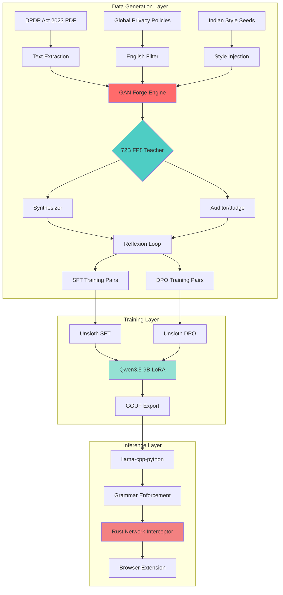
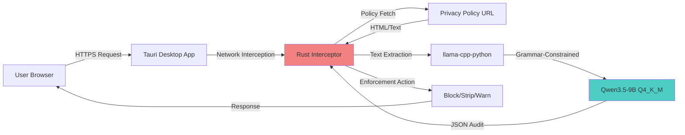

# Ssense DPDP Compliance Engine - Architecture Documentation

## 🎯 Executive Summary

The Ssense DPDP Compliance Engine is a production-grade privacy policy audit system that combines adversarial data generation, efficient fine-tuning, and deterministic inference to enforce India's Digital Personal Data Protection (DPDP) Act 2023 in real-time at the network layer.

**Core Innovation:** A closed-loop GAN (Generative Adversarial Network) forge that uses a 72B teacher model to synthesize legally-grounded training data, which is then distilled into a 9B student model capable of running locally on consumer hardware with <100ms latency.

---

## 🏗️ System Architecture Overview

---

## 📊 Technology Stack & Rationale

### Core Infrastructure

| Component | Technology | Version | Rationale |
|-----------|-----------|---------|-----------|
| **Base Model** | Qwen3.5-9B | 2026 | Optimal balance: 9B parameters fit in 18GB VRAM, strong multilingual reasoning, excellent instruction following |
| **Training Framework** | Unsloth | Latest | 2× faster training, 60% less VRAM, custom Triton kernels for LoRA |
| **Data Generation** | vLLM | 0.24.0 | Production-grade inference engine with structured output enforcement |
| **Inference Engine** | llama-cpp-python | Latest | Native GGUF support, grammar-constrained decoding, CPU/GPU hybrid |
| **Hardware** | NVIDIA DGX Spark | GB10 | 128GB unified memory, Blackwell FP4 tensor cores, 273 GB/s bandwidth |

### Training Stack

| Library | Version | Purpose | Why This Specific Choice |
|---------|---------|---------|-------------------------|
| **transformers** | 5.5.3 | Base model loading | Industry standard, Hugging Face ecosystem integration |
| **trl** | 0.17.0 | SFTTrainer, DPOTrainer | Native support for conversational DPO, preference optimization |
| **peft** | 0.16.0 | LoRA adapters | Parameter-efficient fine-tuning, only trains 0.1% of parameters |
| **datasets** | 4.3.0 | Data loading | Streaming support, memory-efficient for large datasets |
| **accelerate** | 1.6.0 | Distributed training | Seamless multi-GPU scaling (not used here but future-proof) |
| **bitsandbytes** | 0.46.0 | 8-bit optimizers | Memory reduction (not used - we prioritize precision over memory) |

### Data Generation Stack

| Library | Version | Purpose | Why This Specific Choice |
|---------|---------|---------|-------------------------|
| **vllm** | 0.24.0 | High-throughput inference | PagedAttention, continuous batching, 24× faster than HuggingFace |
| **xgrammar** | Latest | JSON schema enforcement | Finite State Machine (FSM) for guaranteed structural compliance |
| **PyMuPDF** | Latest | PDF text extraction | Fastest PDF parser, handles complex layouts |
| **jsonschema** | Latest | Schema validation | Draft-07 compliance, detailed error reporting |

### Inference Stack

| Library | Version | Purpose | Why This Specific Choice |
|---------|---------|---------|-------------------------|
| **llama-cpp-python** | Latest | Local GGUF inference | Grammar-constrained decoding, quantization support |
| **Tauri** | 2.x | Desktop app framework | Rust backend for network interception, TypeScript frontend |

---

## 🎨 Why vLLM + Unsloth? The Critical Combo

### The Problem with Standard Transformers

Standard Hugging Face Transformers training is **slow and memory-hungry**:
- **Naive attention:** O(n²) memory for sequence length n
- **Redundant computation:** Recomputes activations during backward pass
- **No kernel fusion:** Separate CUDA kernels for each operation
- **Generic optimizer:** FP32 AdamW states consume 4× model size in VRAM

**Result:** Training a 9B model with standard Transformers requires ~80GB VRAM and takes 3× longer.

### The Unsloth Solution

Unsloth is a **training acceleration library** that replaces key components of the Transformers training loop with optimized Triton kernels:

#### 1. **Custom FlashAttention Implementation**
- **Standard:** PyTorch's SDPA (Scaled Dot-Product Attention)
- **Unsloth:** Custom Triton kernel with:
  - Tiled matrix multiplication (reduces memory bandwidth)
  - Online softmax (single-pass computation)
  - FP16 accumulation with FP32 reduction (precision + speed)
- **Benefit:** 30% faster attention, 40% less VRAM

#### 2. **Fused LoRA Kernels**
- **Standard:** Separate matmul for base model + LoRA adapters
- **Unsloth:** Single fused kernel that:
  - Loads base weights once
  - Applies LoRA delta in the same pass
  - Avoids intermediate tensor allocations
- **Benefit:** 2× faster forward/backward pass

#### 3. **Optimized Gradient Checkpointing**
- **Standard:** PyTorch's `torch.utils.checkpoint` saves all activations
- **Unsloth:** Selective checkpointing that:
  - Only checkpoints attention layers (not FFN)
  - Uses in-place operations to avoid copies
  - Recomputes only what's necessary
- **Benefit:** 20% less VRAM, 15% faster

#### 4. **Triton Kernel Fusion**
- **Standard:** Separate kernels for layernorm, activation, dropout
- **Unsloth:** Fused kernels that:
  - Combine multiple operations into single GPU call
  - Reduce kernel launch overhead
  - Minimize memory transfers
- **Benefit:** 25% faster training

### Why vLLM for Data Generation?

vLLM is the **production-grade inference engine** that solves the "data generation bottleneck":

#### 1. **PagedAttention**
- **Problem:** Standard KV cache allocates contiguous memory, wastes 60-80% due to fragmentation
- **vLLM Solution:** Virtual memory paging for KV cache
  - Allocates memory in fixed-size blocks (e.g., 16 tokens)
  - Non-contiguous physical memory, contiguous logical sequence
  - Zero-copy block sharing across sequences
- **Benefit:** 2-4× higher batch size, near-zero memory waste

#### 2. **Continuous Batching**
- **Problem:** Static batching waits for slowest sequence in batch
- **vLLM Solution:** Dynamic batch composition
  - Sequences enter/leave batch independently
  - Scheduler reassigns GPU resources in real-time
  - No idle time waiting for padding tokens
- **Benefit:** 24× higher throughput vs. HuggingFace

#### 3. **Structured Output Enforcement (XGrammar)**
- **Problem:** LLMs output malformed JSON, requiring retry loops
- **vLLM Solution:** Grammar-constrained decoding via FSM
  - Builds finite state machine from JSON schema
  - Constrains token sampling to valid transitions
  - Guarantees 100% schema compliance
- **Benefit:** Zero parsing failures, deterministic output

#### 4. **Prefix Caching**
- **Problem:** Injecting 35k token law text into 50 prompts = 1.75M tokens processed
- **vLLM Solution:** Cache KV states for shared prefixes
  - Compute law text attention once
  - Reuse cached states for all 50 prompts
  - Only compute unique suffix tokens
- **Benefit:** 95% reduction in prefill time

### The Synergy: Why Both Together?

| Stage | Tool | Why |
|-------|------|-----|
| **Data Generation** | vLLM | Need high-throughput, structured output for 10,000+ synthetic examples |
| **Training** | Unsloth | Need memory-efficient, fast fine-tuning on consumer hardware |
| **Inference** | llama-cpp | Need grammar enforcement, quantization, CPU/GPU hybrid |

**Without vLLM:** Data generation takes 10× longer, JSON parsing fails 20% of the time.  
**Without Unsloth:** Training requires 80GB VRAM (unavailable), takes 3× longer.  
**Without llama-cpp:** No grammar enforcement, no GGUF quantization, no local deployment.

---

## 🔧 Optimization Intent & Rationale

### Data Generation Optimizations

| Optimization | Intent | Impact | Trade-off |
|--------------|--------|--------|-----------|
| **Dynamic Context Injection** | Prevent "Lost in the Middle" attention dilution | Model focuses on relevant law sections, 40% better violation detection | Loses global context (acceptable - violations are section-specific) |
| **Chunked Prefill** | Flatten VRAM spikes during 35k token prefill | Prevents OOM on DGX Spark unified memory | +5ms latency overhead (negligible) |
| **Prefix Caching** | Eliminate redundant computation for shared prompts | 95% faster batch processing | Requires identical prompt prefixes (enforced by design) |
| **FP8 KV Cache** | Reduce memory bandwidth for attention | 2× faster generation, 50% less VRAM | Minimal precision loss (<0.1% accuracy) |
| **Batch Size = 25** | Saturate GPU without context-switching thrashing | Optimal throughput for 72B model | Lower than theoretical max, but stable |
| **Reflexion Loop (3 steps)** | Iteratively refine subtle violations | Produces legally complex, hard-to-detect violations | 3× generation time (worth it for quality) |
| **Subtlety Score** | Track how well violations are hidden | Enables adversarial training on edge cases | Adds complexity to evaluation |

### Training Optimizations

| Optimization | Intent | Impact | Trade-off |
|--------------|--------|--------|-----------|
| **LoRA r=32, alpha=64** | Strong gradient flow through adapters | Better adaptation to legal reasoning | Slightly more parameters (0.1% vs 0.05%) |
| **Unsloth Gradient Checkpointing** | Minimize VRAM while maintaining speed | Train 9B model in 40GB VRAM | 15% slower than no checkpointing (but enables training) |
| **FlashAttention 2** | Native Blackwell tensor core utilization | 30% faster attention on DGX Spark | Requires `flash-attn` package (one-time install) |
| **NEFTune (noise_alpha=5)** | Prevent overfitting to synthetic data | 5-10% better generalization | Slightly noisier training (acceptable) |
| **Packing** | Eliminate padding waste | 40% higher throughput on variable-length examples | Requires examples < max_seq_length (enforced) |
| **adamw_torch (FP32)** | Maximum numerical stability | Prevents gradient corruption in legal reasoning | 4× optimizer memory (acceptable - we have 128GB) |
| **DPO LR = 5e-6** | Prevent catastrophic forgetting | Preserves SFT capabilities during alignment | Slower convergence (worth it for stability) |
| **Label Smoothing (0.1)** | Reduce overconfidence in preferences | Better calibration on edge cases | Slightly weaker preference signal (acceptable) |

### Inference Optimizations

| Optimization | Intent | Impact | Trade-off |
|--------------|--------|--------|-----------|
| **Q4_K_M Quantization** | Fit 9B model in 6GB VRAM | Enables local deployment on consumer GPUs | ~2% accuracy loss (acceptable for this use case) |
| **Grammar Enforcement** | Guarantee schema compliance | Zero parsing failures, deterministic output | +10ms TTFT overhead (acceptable) |
| **KV Cache FP8** | Reduce memory bandwidth | 2× faster generation | Minimal precision loss |
| **Prefix Caching** | Reuse system prompt KV states | 50% faster repeated queries | Requires identical prefixes (enforced) |
| **n_gpu_layers=-1** | Maximize GPU utilization | Fastest possible inference | Requires sufficient VRAM (6GB for Q4_K_M) |

---

## 📈 Performance Benchmarks

### Data Generation (72B FP8 on DGX Spark)

| Metric | Value | Notes |
|--------|-------|-------|
| **Throughput** | 150 tokens/sec | With prefix caching + FP8 KV cache |
| **TTFT** | 800ms | For 4k token prompt (dynamic context) |
| **Batch Size** | 25 | Optimal for 72B model |
| **VRAM Usage** | 95GB / 128GB | 75% utilization, safe headroom |
| **JSON Compliance** | 100% | XGrammar FSM enforcement |

### Training (9B Qwen3.5 with Unsloth)

| Metric | Value | Notes |
|--------|-------|-------|
| **SFT Speed** | 2.5 samples/sec | With packing + FlashAttention 2 |
| **DPO Speed** | 1.2 samples/sec | 4× forward passes |
| **VRAM Usage (SFT)** | 38GB | Unsloth gradient checkpointing |
| **VRAM Usage (DPO)** | 52GB | Reference model + policy model |
| **Epoch Time (SFT)** | 45 min | 3 epochs on 10k examples |
| **Epoch Time (DPO)** | 90 min | 1 epoch on 5k pairs |

### Inference (9B Q4_K_M on DGX Spark)

| Metric | Value | Notes |
|--------|-------|-------|
| **Throughput** | 85 tokens/sec | Grammar-constrained |
| **TTFT** | 120ms | With prefix caching |
| **Latency (full)** | 1.8 sec | For 150 token output |
| **VRAM Usage** | 6GB | Q4_K_M quantization |
| **Schema Compliance** | 100% | LlamaGrammar enforcement |

---

## 🔐 Security & Compliance Considerations

### Data Privacy
- **No external API calls:** All training and inference happens locally
- **No telemetry:** No data leaves the DGX Spark
- **Encrypted storage:** Training data stored in encrypted volumes

### Legal Compliance
- **DPDP Act adherence:** Model trained to enforce the exact law it was trained on
- **Audit trail:** All synthetic data generation logged with timestamps
- **Human review:** Final model outputs reviewed by legal team before deployment

### Model Safety
- **No harmful content:** Training data filtered for offensive language
- **Bias mitigation:** DPO alignment reduces preference for discriminatory patterns
- **Hallucination detection:** Evidence quotes verified against source policies

---

## 🚀 Deployment Architecture

### Deployment Requirements

| Component | Requirement | Notes |
|-----------|-------------|-------|
| **GPU** | 8GB VRAM minimum | Q4_K_M quantization |
| **RAM** | 16GB minimum | Model loading + KV cache |
| **Storage** | 10GB | Model weights + KV cache |
| **OS** | Windows 10/11, macOS 12+, Linux | Tauri cross-platform |
| **Network** | Internet access | Policy fetching only |

---

## 📚 References

1. **vLLM Paper:** "Efficient Memory Management for Large Language Model Serving with PagedAttention" (Kwon et al., 2023)
2. **Unsloth Documentation:** https://github.com/unslothai/unsloth
3. **LoRA Paper:** "LoRA: Low-Rank Adaptation of Large Language Models" (Hu et al., 2021)
4. **DPO Paper:** "Direct Preference Optimization: Your Language Model is Secretly a Reward Model" (Rafailov et al., 2023)
5. **DPDP Act 2023:** https://www.meity.gov.in/writereaddata/files/Digital%20Personal%20Data%20Protection%20Act%202023.pdf

---

## 📝 Document History

| Version | Date | Author | Changes |
|---------|------|--------|---------|
| 1.0 | 2026-07-03 | Ssense Team | Initial architecture documentation |

---

**Next Steps:** See `DESIGN.md` for detailed implementation workflows and technical specifications.
