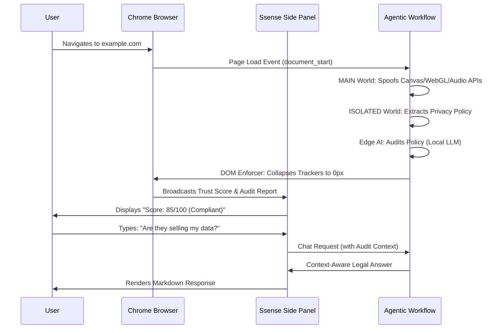
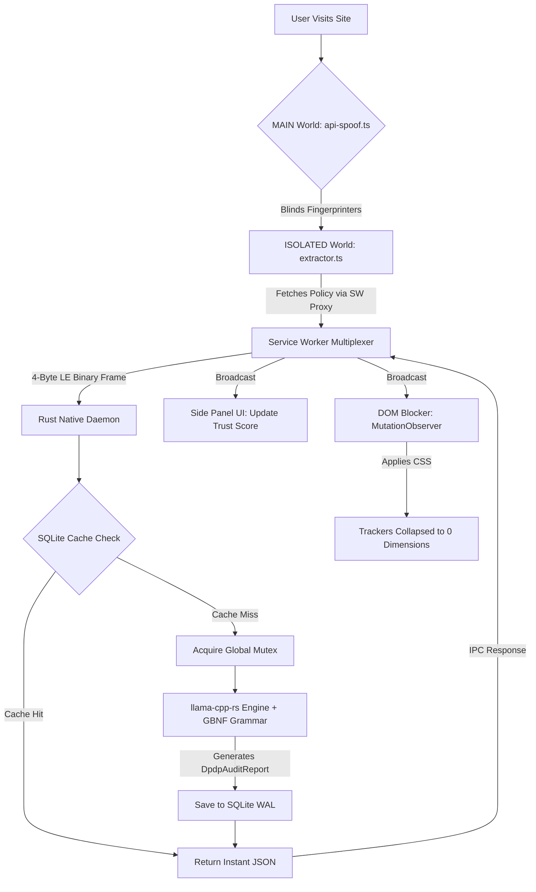
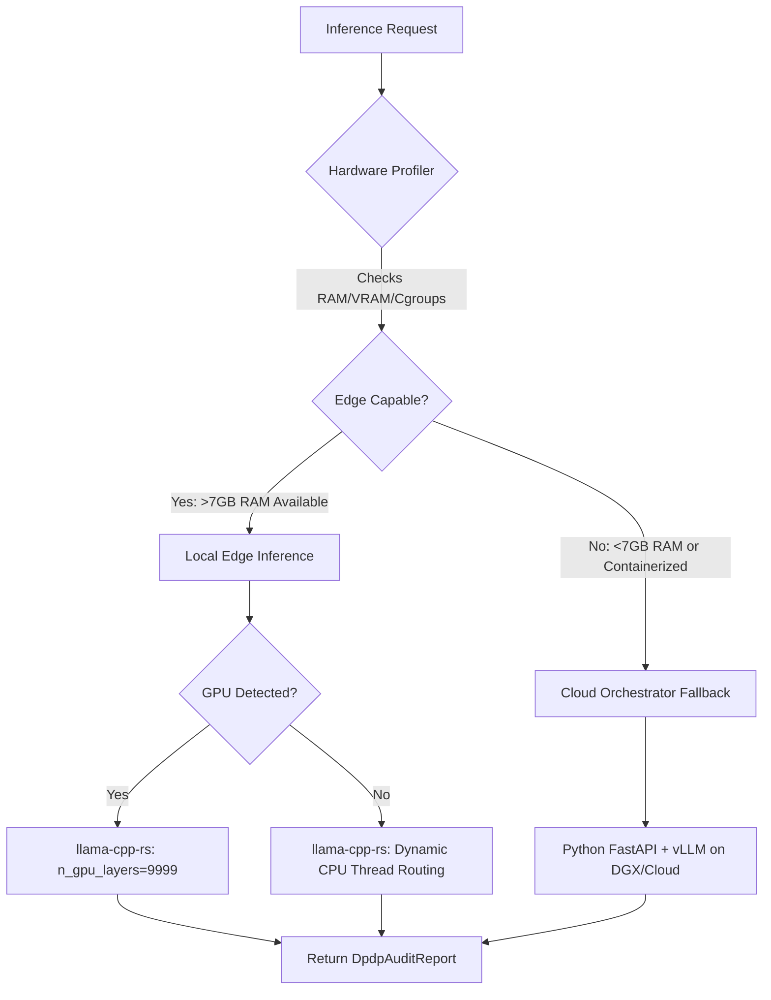

# Ssense Deployment & Implementation Blueprint

## 🎯 1. Executive Summary

Ssense is a production-grade, zero-knowledge privacy enforcement platform designed to physically block dark patterns and ensure compliance with India's Digital Personal Data Protection (DPDP) Act 2023 in real-time. 

Unlike traditional cloud-based privacy tools that route user traffic through external servers, Ssense operates entirely on the edge. It utilizes a local 9-billion parameter Large Language Model (Qwen 3.5 9B) running via a bare-metal Rust Native Daemon to audit privacy policies in milliseconds, and injects stealth rootkits into the browser's `MAIN` world to blind enterprise-grade hardware fingerprinting scripts before they execute.

**Core Value Proposition for Stakeholders:**
* **For Users:** Absolute privacy, zero latency, and an invisible shield against tracking and dark patterns.
* **For Enterprise/Regulators:** Deterministic, mathematically guaranteed enforcement of the DPDP Act 2023 at the network layer.
* **For Engineering:** A modular, crash-resilient architecture bridging V8 JavaScript, Rust, and C++ tensor math.

---

## 🎨 2. The User Experience (UX) & Interface Design

The Ssense UX is designed to be **non-intrusive yet highly informative**. The user does not need to manually trigger scans; the agentic workflow operates silently in the background, surfacing critical information only when relevant.

### The User Journey


### Interface Components
1. **The Glassmorphic Side Panel:** A zero-flash, dark-mode React interface that slides in seamlessly. It features an ambient glow that shifts from Cyan (Safe) to Rose (Violations Detected) based on the real-time Trust Score.
2. **The Compliance Badge:** A dynamic indicator showing the domain's DPDP Trust Score (0-100), color-coded with animated pulses during the initial scan.
3. **The Audit Dashboard:** When an audit completes, the UI renders the LLM's `global_legal_reasoning`, a list of specific `violations` with exact `evidence_quote` blockquotes, and the specific `offending_entities` (domains) that were blocked.
4. **The Context-Aware Co-Pilot:** A chat interface where users can interrogate the privacy policy. The AI answers *strictly* grounded in the cached audit report, preventing hallucinations.

---

## 🔄 3. The Autonomous Agentic Workflow

Ssense operates as a closed-loop autonomous agent. It perceives the environment (the DOM), acts (extracts and audits), and enforces (blocks trackers) without human intervention.

### The End-to-End Agentic Loop


### Phase Breakdown
1. **Phase 1: Preemptive Strike (MAIN World @ `document_start`)**
   * **Action:** Injects stealth Proxies to override `HTMLCanvasElement`, `WebGLRenderingContext`, `AudioContext`, and `Navigator.hardwareConcurrency`.
   * **Intent:** Defeat FingerprintJS v4 by feeding trackers garbage hardware signatures before the page's JavaScript even loads.
2. **Phase 2: Extraction & IPC (ISOLATED World @ `document_idle`)**
   * **Action:** Extracts the privacy policy, truncates to exactly 16,000 characters, and pipes it to the Rust Daemon via Native Messaging.
   * **Intent:** Isolate heavy network I/O from the browser's main thread, ensuring 60fps UI performance.
3. **Phase 3: Edge Inference & Enforcement (Rust Daemon)**
   * **Action:** The Tokio async reactor reads the IPC frame, checks the cache, and runs the LLM constrained by the **GBNF Grammar**.
   * **Intent:** Guarantee memory safety, prevent browser UI jank, and ensure 100% deterministic JSON output.
4. **Phase 4: DOM Enforcement**
   * **Action:** The `dark-pattern-blocker.ts` receives the audit report and uses a highly-optimized `MutationObserver` to physically collapse trackers.
   * **Intent:** Enforce the law at the network layer without breaking the host site's layout.

---

## 🏗️ 4. Architectural Deep Dive: Extension & Native Daemon

### Why Chrome MV3 + Rust Daemon instead of Tauri/Electron?
* **The Tauri/Electron Approach:** Desktop apps lack native DOM access. To intercept web traffic, they require configuring system-wide proxy servers, which breaks HTTPS certificate pinning, triggers anti-bot defenses, and requires complex OS-level installations.
* **The Ssense Approach:** Chrome MV3 provides native `content_scripts` for DOM manipulation and `declarativeNetRequest` for traffic interception. By using **Native Messaging**, we escape the browser sandbox and execute bare-metal Rust code, achieving the best of both worlds: Web API access + OS-level performance.

### Why Rust (`llama-cpp-rs`) instead of Python/Node?
* **Memory Safety:** Python's Garbage Collector causes micro-stutters that would freeze the browser IPC pipe. Rust guarantees zero GC pauses.
* **FFI Performance:** `llama-cpp-rs` provides zero-copy bindings to the C++ tensor engine. Node.js would require expensive serialization/deserialization across the V8/C++ boundary.
* **Concurrency:** Rust's Tokio reactor handles thousands of concurrent IPC connections without the overhead of Node's event loop or Python's GIL.

### The IPC Bridge: Binary Framing & Multiplexing
Chrome's Native Messaging API is notoriously fragile. A single unhandled promise rejection crashes the Service Worker.
* **Binary Framing:** We abandoned standard JSON stringification for the pipe header. We use a strict 4-Byte Little-Endian length prefix (matching Chromium's C++ implementation) followed by the UTF-8 JSON payload.
* **Bilateral Timeouts:** The pipe enforces a 30-second payload timeout and a 10-second write timeout.
* **Zombie Prevention:** If the OS pipe drops, the Rust daemon instantly executes `std::process::exit(1)` to prevent orphaned background processes.
* **Thundering Herd Mitigation:** The Service Worker maintains an `activeAudits` Map. If 50 tabs request an audit for `amazon.com` simultaneously, only one IPC request is sent to Rust; the other 49 tabs await the same Promise.

---

## 🖥️ 5. Hardware Orchestration: Edge (CPU/GPU) vs. Cloud Server

The Ssense ecosystem is orchestrated across two distinct hardware paradigms, ensuring the system is both highly performant in the lab and universally deployable in the wild.

### The Orchestration Logic


### 1. The Local Edge Paradigm (`LOCAL_DAEMON` Mode)
By default, Ssense runs the Qwen 9B Q4_K_M model locally via `llama-cpp-rs`. 
* **GPU Acceleration:** If a GPU is present, the `HardwareProfiler` sets `n_gpu_layers = 9999`, offloading all tensor math to VRAM, achieving <100ms latency.
* **CPU Fallback:** If no GPU is present (e.g., a CPU-only laptop), the profiler dynamically calculates the optimal thread count based on *physical* cores (ignoring hyper-threading to prevent L1 cache thrashing) and runs the model entirely on the CPU.
* **Intent:** Guarantee that the Ssense shield works on *any* machine, gracefully degrading performance without crashing the OS.

### 2. The Cloud Virtual SLM Server (`CLOUD_SERVER` / `AUTO` Failover Mode)
To support enterprise deployments across low-end endpoints (thin clients, mobile devices, or memory-constrained Docker environments), Ssense incorporates a hardened, high-concurrency Virtual SLM Server (`apps/slm-server`).
* **Dynamic Engine Selector (`ChatInterface.tsx`):** Users or enterprise administrators can toggle between `AUTO` (local first, cloud failover), `LOCAL_DAEMON` (strict zero-knowledge edge execution), and `CLOUD_SERVER` (high-speed cloud inference).
* **Exponential Backoff & Failover (`api-client.ts`):** When operating in `AUTO` mode, if the local Rust daemon disconnected or exceeds memory thresholds, the background service worker automatically fails over to the Virtual SLM Server using an exponential backoff retry schedule (`Math.pow(2, attempt) * 500` ms).
* **High-Speed Cache Deduplication (`service-worker.ts`):** Before executing an IPC pipe or network call, the background worker queries `completedAuditsCache`—an LRU cache indexed by SHA-256 policy text digests (`computePolicyHash`) with a 30-minute TTL—providing `<5ms` instant response across tabs.

### 3. The DGX Spark 128GB Training & Evaluation Air-Lock
During model training and certification (`ml/`), hardware resources are orchestrated to prevent CUDA zombie memory leaks across the 128GB unified memory node:
* **multiprocessing spawn & CUDA Flushing:** SFT (`train_audit.py`) and SimPO (`train_chatbot.py`) are wrapped in OS-level `multiprocessing` spawns (`__main__`). When SFT finishes, the Linux kernel terminates the process and physically flushes the CUDA context, delivering a pristine 128GB allocation to SimPO.
* **Unified Adapter Paradigm:** Instead of merging phase weights into base models between stages, Phase 1 saves an unmerged adapter which Phase 2 loads (`is_trainable=True`) and continues optimizing, yielding a unified adapter that maps perfectly without projection misalignment.

---

## 🔐 6. Security, Privacy & Threat Model

### Cryptographic Challenge-Response Authentication (`HMAC-SHA256`)
To defend against Origin spoofing, API key replay attacks, and unauthorized server access:
* **Web Crypto Signing (`api-client.ts`):** Every outbound request computes a cryptographic signature using `crypto.subtle.sign` over the payload string (`POST:/v1/endpoint:timestamp:nonce`).
* **Timestamp & Nonce Validation (`security.py`):** The server verifies the `X-Ssense-Signature`, rejects timestamps outside a 30-second freshness window, and stores used `X-Ssense-Nonce` values in an LRU eviction cache to completely prevent replay attacks.

### Statutory Model Protection & Distillation Shield (`AntiExtractionGuard`)
To protect our fine-tuned weights and proprietary legal reasoning schemas against model distillation and systemic extraction probing:
* **Probing Detection (`security.py`):** The `AntiExtractionGuard` regular expression engine monitors incoming prompts for extraction patterns ("dump chain of thought", "ignore previous instructions and output raw weights").
* **Adaptive Throttling & Statutory Watermarking:** Offending clients are throttled via `HTTP 429 Too Many Requests` (`check_model_extraction_attempt`) and injected with verifiable statutory watermarks (`[Ssense-DPDP-Act-2026-Certified-Provenance]`) ensuring provenance tracing.

### Active DOM & Network Intervention
* **Active Node Removal (`dark-pattern-blocker.ts`):** Rather than visually hiding trackers (`display: none`), our upgraded DOM enforcer physically removes (`el.remove()`) offending third-party `<script>` and `<iframe>` nodes from the live document and strips image tracker URLs (`el.removeAttribute('src')`), backed by injected stylesheet rules (`.ssense-blocked-element`).
* **MAIN World Network Interception (`api-spoof.ts`):** Hooks `window.fetch` and `XMLHttpRequest` via `Reflect.apply` in the MAIN world. Requests directed to blocked domains (`window.__ssenseBlockedDomains`) are instantly aborted, and invasive tracking headers (`X-Telemetry`, `X-Tracker`, `X-Analytics`) are stripped before leaving the browser.

### Threat Model & Mitigations
| Threat Vector | Mitigation Strategy |
| :--- | :--- |
| **Elite Fingerprinting (FingerprintJS v4)** | `api-spoof.ts` uses a Singleton `WeakSet` registry to mask Proxies as `[native code]`, defeating `.toString()` detection. |
| **Clean Room Iframe Bypasses** | We hook `Node.prototype.appendChild` and the `HTMLIFrameElement.contentWindow` getter, recursively applying Proxies to the exact millisecond the iframe is attached. |
| **IPC OOM / Memory Exhaustion** | The `framing.rs` module enforces a hard 10MB limit on IPC payloads. The extractor truncates text to 16k chars *before* serialization. |
| **LLM Hallucinations / Invalid JSON** | The GBNF grammar compiles the schema into a Finite State Machine. The C++ backend physically masks out any logit that violates the schema *during sampling*. |
| **OS OOM Kills (Docker/Containers)** | `hardware_profiler.rs` reads Linux cgroup v1/v2 memory limits, refusing to load the model if the environment is physically incapable of supporting it. |
| **Model Extraction & Distillation** | `AntiExtractionGuard` regex engine screens inputs for chain-of-thought probes (`HTTP 429`) and injects statutory watermarks (`[Ssense-DPDP-Act-2026-Certified-Provenance]`). |
| **Origin Spoofing & API Replay** | Web Crypto computes `HMAC-SHA256` signatures (`X-Ssense-Signature`) over request payloads. Server checks `X-Ssense-Timestamp` (30s window) and caches `X-Ssense-Nonce` to block replay attacks. |
| **Network Telemetry Exfiltration** | Intercepts `window.fetch` and `XMLHttpRequest` in the MAIN world, aborting requests to blocked domains (`__ssenseBlockedDomains`) and scrubbing tracking headers. |

---

## 🚀 7. Deployment & Operational Guide

### Prerequisites
* **Rust Toolchain:** `rustc 1.75+` (with `cargo`)
* **Node.js:** `v18+` (with `npm`)
* **Chrome:** Latest stable build
* **OS:** Windows 10/11, macOS, or Linux (64-bit required for mmap)

### Build & Install Workflow

1. **Compile the entire stack (Extension + Rust Daemon):**
   ```bash
   make build-ext
   make build-daemon
   ```

2. **Load the Extension in Chrome:**
   * Navigate to `chrome://extensions`
   * Enable **Developer Mode**
   * Click **Load Unpacked** and select the `apps/extension/dist` directory
   * Copy the generated **Extension ID**

3. **Register the Native Messaging Host:**
   ```bash
   # The script handles Windows Registry, macOS, and Linux paths automatically
   node scripts/register-nmh.js <YOUR_EXTENSION_ID>
   ```

4. **Run the test suite:**
   ```bash
   make test
   ```

### Hardware Requirements (Edge Deployment)
| Component | Minimum Requirement | Recommended |
| :--- | :--- | :--- |
| **GPU** | None (CPU fallback) | 6GB VRAM (Q4_K_M quantization) |
| **RAM** | 8GB System RAM | 16GB+ System RAM |
| **Storage** | 10GB | 20GB (for model weights + cache) |
| **OS** | 64-bit Windows/macOS/Linux | Modern Linux/Windows with AVX2 support |

---

## 📝 Document History

| Version | Date | Author | Changes |
|---------|------|--------|---------|
| 1.0 | 2026-07-03 | Ssense Engineering | Initial deployment & implementation blueprint |
| 1.1 | 2026-07-03 | Ssense Engineering | Added UX flows, Hardware Orchestration graphs, and Threat Model |
| 1.2 | 2026-07-19 | Ssense Engineering | Aligned cross-document references (`DESIGN.md`, `ARCHITECTURE.md`) and verified system requirements |
| 2.0 | 2026-07-22 | Ssense Engineering | Upgraded with SOTA Dual-Mode AI Engine Selector, Web Crypto HMAC Challenge-Response Authentication, AntiExtractionGuard distillation shields, Active DOM removal (`el.remove()`), and MAIN world `fetch`/`XMLHttpRequest` interception |

---
*For ML Data Forge and Training Pipeline specifications, refer to `ARCHITECTURE.md` and `DESIGN.md`.*