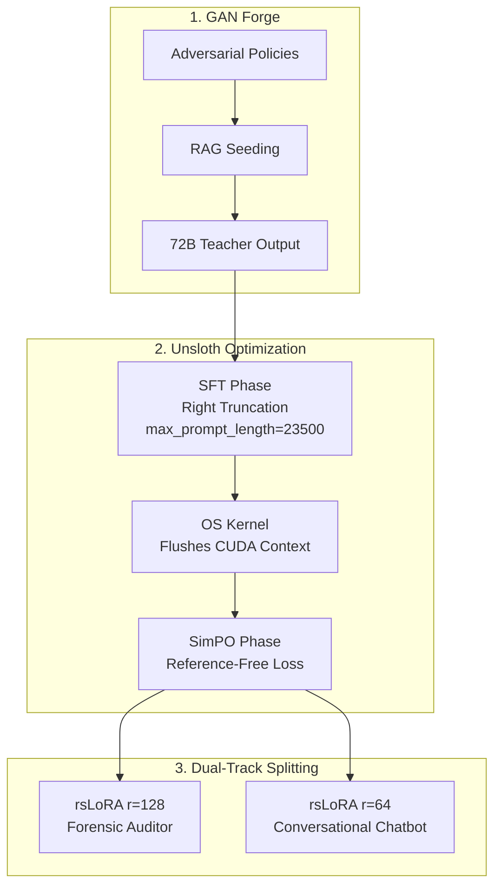

# Ssense DPDP Compliance ML Platform – Technical Design Document

> **The definitive architectural blueprint for the Ssense Machine Learning Pipeline. This document details the end-to-end dataset generation (GAN Forge) and Dual-Track SLM fine-tuning infrastructure engineered to enforce India's Digital Personal Data Protection (DPDP) Act 2023.**

---

## 📋 Table of Contents

1. [Architectural Philosophy](#1-architectural-philosophy)
2. [Stage 1: Adversarial Data Forge (`ml/data-forge`)](#2-stage-1-adversarial-data-forge-mldata-forge)
3. [Stage 2: High-Performance SLM Training (`ml/slm-training`)](#3-stage-2-high-performance-slm-training-mlslm-training)
4. [Hardware & Output Artifact Routing](#4-hardware--output-artifact-routing)

---

## 1. Architectural Philosophy

The **Ssense ML Pipeline** is built on a paradigm of **Teacher-Student Distillation and Adversarial Reinforcement**. Instead of relying on generalized, hallucination-prone frontier models (e.g., GPT-4 or Claude), we utilize a massive local 72B parameter teacher model (`Qwen2-72B-Instruct-FP8`) to synthetically generate highly precise, legally compliant training data. 

This data is then subjected to **SimPO (Simple Preference Optimization)** to align a highly efficient 9B parameter edge model (`Qwen3.5-9B`). This approach yields an edge-deployable Small Language Model (SLM) capable of outperforming generic foundation models in strict Indian legal contexts, with a 0% jurisdictional contamination rate (zero GDPR/CCPA bias).

---

## 2. Stage 1: Adversarial Data Forge (`ml/data-forge`)

The `data-forge` module is a completely autonomous, deterministic data factory responsible for synthesizing standard Supervised Fine-Tuning (SFT) and preference (DPO/SimPO) datasets.

### 2.1 The GAN Forge Orchestrator (`gan_forge.py`)
This engine uses the 72B Teacher Model to generate millions of synthetic data points. It operates in an adversarial loop:
*   **Contextual RAG Seeding:** Prior to generation, `gan_forge.py` dynamically injects exact statutory chunks of the DPDP Act 2023 into the teacher model's context window. This ensures that the generated privacy policies and audit JSONs are perfectly grounded in Indian law.
*   **Adversarial Edge-Case Generation:** The Forge actively generates "toxic" policies—policies containing deceptive dark patterns, hidden children's tracking clauses, and perpetual data retention clauses—to train the model to ruthlessly identify non-compliance.
*   **Dual-Track Synthesis:**
    *   **Audit Track:** Generates massive JSON arrays detailing violation mapping, trust scoring (0-100), and legal reasoning.
    *   **Chatbot Track:** Generates conversational QA pairs explaining compliance issues to end-users in accessible language.
*   **Hallucination Sanitization:** Includes strict post-processing heuristic filters to permanently eradicate "toxic context poisoning" (e.g., filtering out the DPDP Act's Second/Seventh Schedules, which only apply to Government intelligence agencies).

### 2.2 RAG Pre-Computation (`build_dpdp_tree.py` & `build_vector_db.py`)
To prevent the Teacher Model from confabulating law, the exact PDF texts of the DPDP Act 2023 and the DPDP Rules 2025 are parsed, chunked, and vectorized using `build_vector_db.py`. 
*   **Hybrid Search DB:** Vectors are stored offline using `bge-small-en-v1.5` dense embeddings and BM25 lexical indexing, creating an ultra-fast local dictionary for the GAN Forge to draw legal inspiration from during generation.

### 2.3 Unsloth Preparation (`prepare_unsloth_data.py`)
Raw JSON outputs generated by the 72B teacher are notoriously messy. This script reformats the raw synthetic arrays into strict `{"prompt": "...", "chosen": "...", "rejected": "..."}` JSONL schemas perfectly aligned for Unsloth SimPO consumption. It also forcefully strips trailing whitespace from JSON keys (a fatal bug that otherwise corrupts HuggingFace dataset mapping).

---

## 3. Stage 2: High-Performance SLM Training (`ml/slm-training`)

The `slm-training` module leverages the **Unsloth framework** to execute mathematically optimized fine-tuning within a 128GB VRAM hardware constraint (e.g., NVIDIA DGX H100 or Multi-A100 clusters).

### 3.1 Dual-Track Specialization (`train_audit.py` & `train_chatbot.py`)
Instead of forcing a single 9B model to be both a strict JSON compliance auditor and a friendly conversational bot, we split the training into two specialized LoRA adapters.

1.  **The Forensic Auditor (`train_audit.py`):**
    *   *Architecture:* Fine-tunes `Qwen3.5-9B` at `Rank 128` (Alpha 256) to grant the neural network deep syntactic control over strict JSON schema generation.
    *   *Objective:* Maximize precision in DPDP violation detection and trust score calibration.
2.  **The Conversational Chatbot (`train_chatbot.py`):**
    *   *Architecture:* Fine-tunes at `Rank 64` (Alpha 128). 
    *   *Objective:* Optimize for empathetic, clear, and legally sound explanatory dialogue (Co-Pilot track).

### 3.2 Advanced Memory & Process Isolation
Standard Hugging Face training causes severe memory leaks. The Ssense pipeline introduces strict process isolation:
*   **OS-level `spawn` Multiplexing:** SFT and SimPO are wrapped in OS-level `multiprocessing spawn` environments. When Phase 1 (SFT) finishes, the Linux kernel terminates the process, physically flushing the CUDA context to deliver a pristine 128GB VRAM allocation to Phase 2 (SimPO).
*   **Right-Side Truncation & `max_prompt_length`:** Standard training truncates from the left, dropping the critical System Prompt and `[RETRIEVED_LAW_CONTEXT]`. We explicitly configure right-side truncation and right-side padding. By setting a hard `max_prompt_length=23500`, we ensure the prompt is perfectly preserved while guaranteeing at least 1076 tokens remain exclusively for the massive JSON generation output.

### 3.3 Two-Phase Training (SFT + SimPO)
Each script executes a rigorous two-phase pipeline:
*   **Phase 1 (SFT):** Supervised Fine-Tuning ingests the `sft` datasets to align the model's base syntactic format and structural tone.
*   **Phase 2 (SimPO):** Simple Preference Optimization ingests the `dpo` pairs. SimPO uses the implicit reward model directly within the policy network, eliminating the need to load a separate reference model, saving massive VRAM overhead while dramatically improving the model's ability to reject hallucinations and dark patterns.

### 3.4 Export Hooks & Multi-LoRA Edge Deployment
Upon completion, the training scripts execute dual-deployment export hooks:
*   **PEFT LoRA Safetensors:** The adapters are saved natively via `model.save_pretrained_merged(..., save_method="lora")`. This permits our production backend (`slm-server`) to load a single FP8 Base Model and hot-swap the two adapters dynamically using vLLM's `--enable-lora` feature.
*   **GGUF Q4_K_M Automation:** Immediately appended to the training cycle is an automated `export_gguf()` routine. This quantizes both adapters into 4-bit `q4_k_m` GGUF binaries, ensuring seamless deployment fallback onto pure CPU architectures (`LOCAL_DAEMON`).

---

## 4. Hardware & Output Artifact Routing

*   **Training Hardware:** NVIDIA DGX System (128GB VRAM minimum for 72B Teacher Generation and 9B SimPO Training).
*   **Base Models (`ml/models/`):** Houses the untouched foundation models.
*   **Generated Datasets (`ml/data-forge/training-pairs/`):** Contains the sanitized `sft`, `dpo`, `chatbot-sft`, and `chatbot-dpo` JSON arrays.
*   **Final Output Artifacts:** The final PEFT LoRA adapters and GGUF binaries are successfully routed back to `ml/models/audit-model-final-adapter` and `chatbot-model-final-adapter` for immediate ingestion by the Ssense Edge inference server.