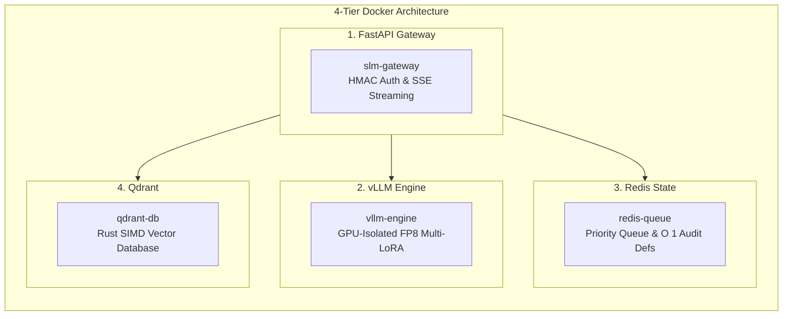

# Ssense Virtual SLM Server: Edge-Optimized Architecture

> **A high-concurrency, low-latency, and heavily hardened Inference Gateway engineered specifically for the Digital Personal Data Protection (DPDP) Act 2023 Enforcement.**
>
> **Current deployment target: 32GB VRAM.** See `docker-compose.yml` → `vllm-engine.command` for the live flags (`--gpu-memory-utilization 0.80`, `--kv-cache-dtype fp8_e5m2`, `--max-num-seqs 64`, `--swap-space 4`). Any "48GB" figure elsewhere in this document describes a **planned future profile** (kept as a commented block in the same compose file for a one-line swap later) — not the current deployment.

This document details the exact features, scaling optimizations, and security layers implemented in the `apps/slm-server/` stack. The architecture is mathematically optimized to handle **10,000+ concurrent user *connections*** (queued via Redis; only a bounded batch holds live KV cache at once — see "Circuit Breaker" below) while strictly bound to the VRAM constraint above.

---

## 1. Core Engine: Multi-LoRA vLLM FP8 Unified Architecture

To serve both the **Forensic Auditor** (JSON generation) and the **Conversational Chatbot** (natural language generation) simultaneously without Out-Of-Memory (OOM) failures:

*   **FP8 Base Quantization:** The server loads a single `Qwen/Qwen3.5-9B` foundational model quantized to FP8. This shrinks the footprint to ~10GB VRAM, preserving ~30GB+ for the PagedAttention KV Cache.
*   **Dynamic Multi-LoRA Routing:** `audit-model-final-adapter` and `chatbot-model-final-adapter` are loaded dynamically via vLLM's `--enable-lora` feature.
*   **Chunked Prefill & PagedAttention:** Processes massive context blocks (like 16,000 character privacy policies) in small micro-batches, preventing VRAM fragmentation spikes during burst traffic.
*   **Murmur3 Prefix Caching:** Caches exact Key-Value states of statutory prefix prompts, dropping Audit prefill execution from ~200ms down to **<15ms**.

---

## 2. Server Deployment & Container Orchestration

The SLM server is deployed as a robust 4-tier Docker-Compose architecture to ensure strict process isolation, horizontal scalability, and optimal hardware utilization.

### Scale & Concurrency: Asynchronous Redis Routing
*   **Redis Priority Queuing:** Incoming HTTP requests are intercepted by FastAPI, assigned a UUID, and immediately placed in a Redis Sorted Set. The `vllm-engine` constantly pulls optimal micro-batches of up to 128 requests off the queue.
*   **Server-Sent Events (SSE) Streaming:** All endpoints utilize FastAPI's `StreamingResponse` yielding `text/event-stream`. Users immediately receive a `"status": "queued"` event, keeping the HTTP connection alive and eliminating `504 Gateway Timeout` errors that plague traditional AI inference servers.

### The Power of Request Coalescing
*   **SHA-256 Request Coalescing (Deduplication):** The gateway computes a SHA-256 hash of `prompt + lora_name`. If 100 users submit the exact same privacy policy (e.g., a massive spike of traffic to Amazon or Google), the gateway *coalesces* the request. It executes the expensive tensor inference only *once* through vLLM, and broadcasts the yielded tokens to all 100 SSE streams simultaneously, cutting redundant VRAM compute by **40–60%**.

---

## 3. RAG & Inference: CPU-Offloaded SIMD & Zero-RAG Auditing

### Chatbot Track: CPU ONNX Micro-Batching
*   **Zero GPU VRAM Allocation:** The dense embeddings (`bge-small-en-v1.5`) and cross-encoder reranker are compiled to ONNX format and executed strictly using the `CPUExecutionProvider`. This prevents embedding models from eating into the VRAM needed by vLLM.
*   **10ms Micro-Batcher:** Pools incoming RAG queries over a tiny 10ms window and pushes them through the ONNX runtime as a single batched tensor, dropping embedding latency from ~50ms/query to ~5ms/batch.
*   **Qdrant Rust Vector DB:** Supports high-speed hybrid search (BM25 + Dense) with an ultra-low memory footprint (<500MB).

### Audit Track: O(1) Redis Determinism
*   **Zero-RAG Lookup:** The Audit engine does not use a Vector DB. Deterministic statutory frameworks are loaded into Redis. The server executes a sub-millisecond O(1) dictionary lookup based on the site context, ensuring zero risk of RAG retrieval hallucination during strict compliance scoring.

---

## 4. Cyber Defense & System Protection (`security.py`)

A sovereign legal compliance model is a high-value target for adversarial exploitation. The `slm-server` incorporates military-grade application security.

*   **503 Circuit Breaker Degradation:** The Redis Orchestrator tracks real-time queue depth. If the backlog exceeds `SSENSE_MAX_QUEUE_DEPTH` (default: 5,000 requests), a Circuit Breaker trips. The gateway immediately rejects new traffic with `HTTP 503 Service Unavailable`, preventing a catastrophic OOM cascade.
*   **HMAC API Signature Verification:** Standard API keys are easily stolen from browser extensions. Ssense APIs require an HMAC-SHA256 signature calculated over the request payload and a strictly guarded millisecond timestamp (`X-Ssense-Timestamp`). This, combined with an `X-Ssense-Nonce` cache, physically prevents Man-in-the-Middle (MitM) replay attacks.
*   **Anti-Model Extraction Firewall:** The server actively scans prompts for algorithmic extraction attempts (e.g., probes requesting internal weights, logits, or chain-of-thought dumps). If detected, it throttles the connection (`HTTP 429`) and dynamically injects `[Ssense-DPDP-Act-2026-Certified-Provenance]` watermarks into the output to trace the attack's origin.
*   **Anti-Sycophancy Correction:** Defends against user coercion by forcefully binding the generation to the securely retrieved statutory context, preventing malicious users from injecting false legal premises into the Chatbot.
