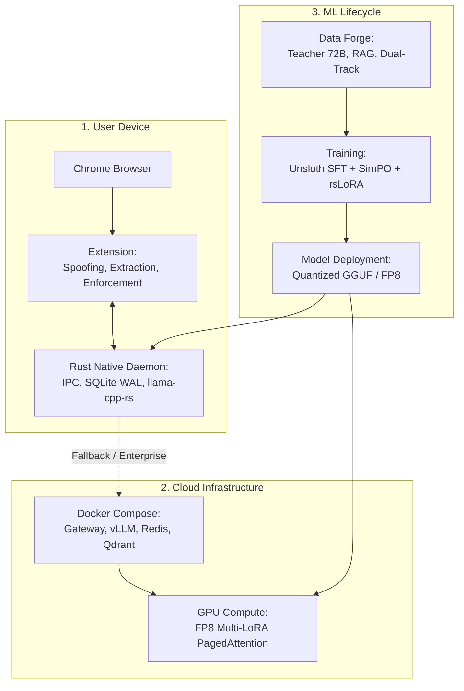
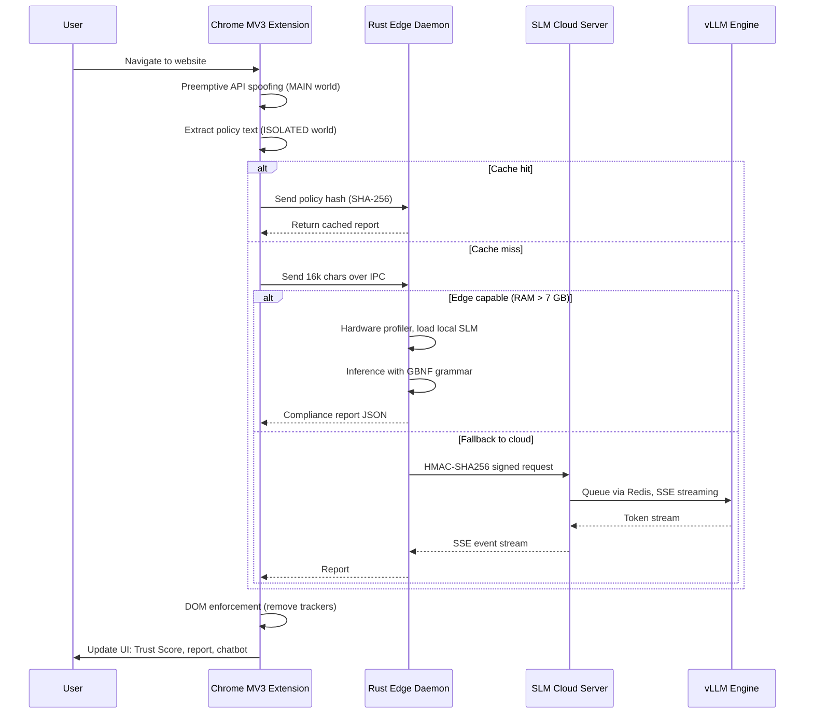
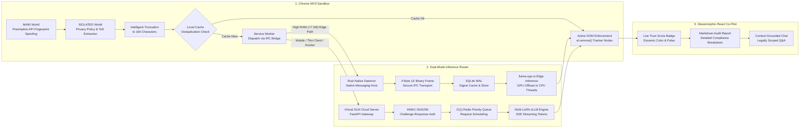
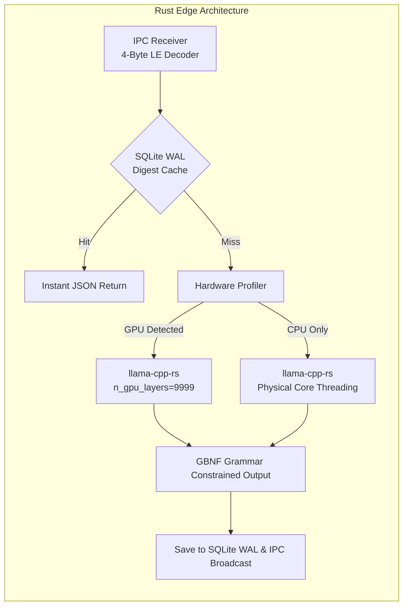
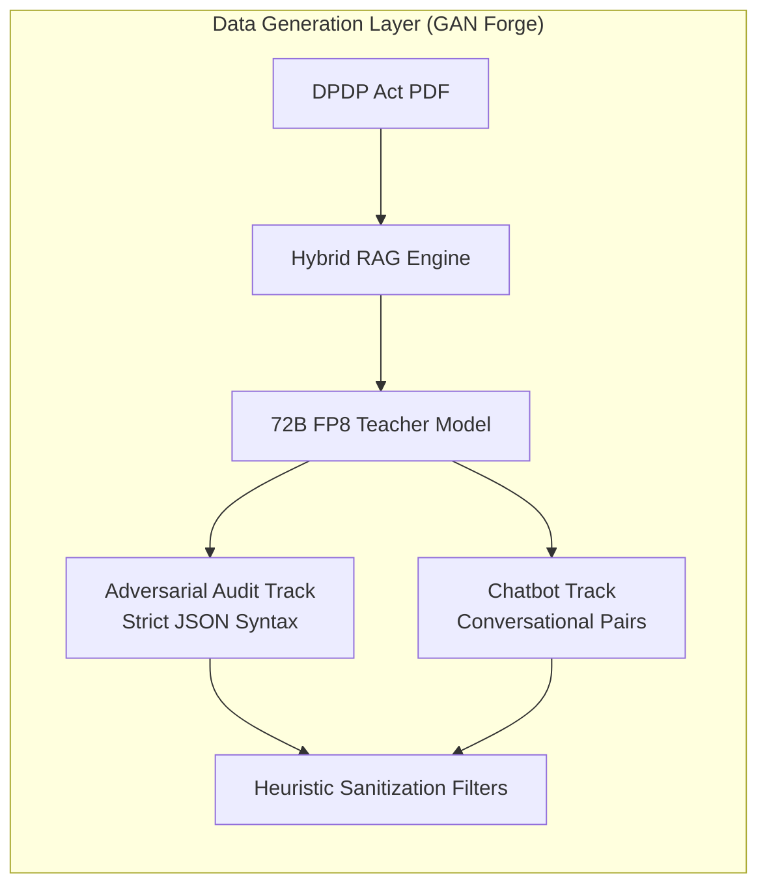
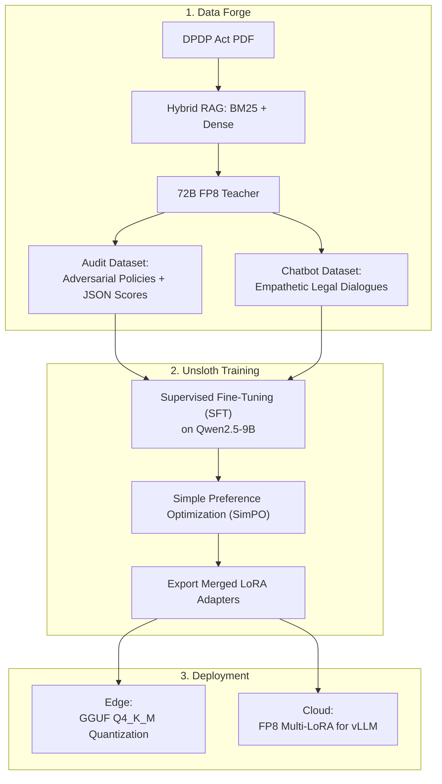

# Ssense DPDP Compliance Engine: Comprehensive Project Report

## Abstract

In the modern digital economy, privacy has transitioned from a fundamental human right to a complex, multi-layered technical and legal challenge. Ssense is a production-grade, edge-native privacy platform designed to autonomously automate, monitor, and enforce compliance with India's Digital Personal Data Protection (DPDP) Act 2023. Unlike traditional cloud-based privacy tools that route sensitive user traffic through external proxy servers—often introducing new privacy risks and breaking end-to-end encryption—Ssense operates primarily on the edge, bringing advanced artificial intelligence directly to the user's local device. 

The system utilizes a specialized, dual-track Small Language Model (SLM), fine-tuned via advanced Distilled Preference Optimization (SimPO) to act as both a strict Forensic Legal Auditor and an empathetic Conversational Assistant. By bridging a highly privileged Chrome Manifest V3 (MV3) extension with a bare-metal Rust native daemon, Ssense audits complex corporate privacy policies locally in milliseconds. Furthermore, it actively intercepts invasive tracking mechanisms, blinding hardware fingerprinters before they execute. For enterprise scale, mobile endpoints, or hardware-constrained environments, the architecture seamlessly fails over to a highly hardened, 48 GB VRAM-optimized FastAPI Cloud Server utilizing vLLM PagedAttention and O(1) Redis Queuing. This report provides an exhaustive architectural analysis of the system's design, focusing on the Machine Learning (ML) data forge, SLM training methodologies, Edge and Cloud execution environments, the browser extension enforcement mechanisms, overarching user workflow, and military-grade security infrastructure.

---

## 1. Introduction

### 1.1 Project Objectives

The primary objective of the Ssense platform is to eliminate the severe asymmetry of information that exists between massive data fiduciaries (corporations) and data principals (end-users). Historically, privacy policies have been engineered using complex legalese, creating deceptive "dark patterns" designed to confuse users into surrendering their data. Ssense aims to structurally dismantle these dark patterns by deploying an autonomous AI agent capable of reading, understanding, and scoring these policies against the strict legal parameters of the DPDP Act 2023. 

Furthermore, a critical objective was to solve the "Jurisdictional Contamination" problem inherent in general-purpose Large Language Models (LLMs). When asked to audit privacy laws, standard foundational models (like base Qwen or Llama) inherently hallucinate Western privacy concepts like the European Union's GDPR (e.g., "Article 17 Right to be Forgotten") or California's CCPA, which have absolutely no legal standing in Indian law. Ssense was explicitly engineered to eradicate this contamination, ensuring zero-hallucination compliance strictly rooted in Indian jurisprudence and acknowledging statutory silence when the law does not prescribe specific technical mandates.

### 1.2 What We Have Designed

To achieve these objectives, we have designed a multi-tiered, closed-loop architectural framework that eliminates reliance on third-party cloud APIs:
- **The Adversarial Data Forge:** An autonomous generative system that uses a massive 72-Billion parameter "Teacher" model to synthesize millions of highly accurate, legally grounded training examples through Hybrid RAG (Retrieval-Augmented Generation) seeding.
- **A Dual-Track Small Language Model (SLM):** Instead of a generalized model, we designed a split-personality SLM using Rank-Stabilized LoRA (rsLoRA). One track (Rank 128) is mathematically constrained to output strict JSON compliance scorecards (The Auditor), while the other (Rank 64) is optimized for empathetic, legally sound dialogue (The Chatbot).
- **A Tri-State Orchestration Engine:** A routing system that dynamically selects the optimal execution environment (Edge CPU, Edge GPU, or Cloud) based on real-time hardware profiling, guaranteeing execution across any device.

### 1.3 What We Are Building

We have successfully built and deployed the execution layers of this design:
- **The Browser Enforcement Layer:** A Chrome MV3 extension that acts as the "eyes and hands" of the AI, blinding hardware fingerprinters (Canvas/WebGL) and actively stripping tracking nodes from the live Document Object Model (DOM) using `el.remove()`.
- **The Edge AI Engine:** A bare-metal Rust Native Daemon (`llama-cpp-rs`) that runs inference locally over a secure 4-Byte Little-Endian binary IPC pipe, ensuring zero-knowledge privacy where user browsing data never leaves the physical machine.
- **The Virtual SLM Cloud Server:** An enterprise-grade, high-concurrency FastAPI server deployed via a 4-tier Docker architecture, utilizing vLLM PagedAttention, Server-Sent Events (SSE) streaming, and military-grade HMAC-SHA256 authentication.

### 1.4 Our Final Goals

Our ultimate goal is to establish Ssense as the deterministic, mathematically guaranteed standard for network-layer DPDP Act enforcement. For end-users, the goal is absolute privacy and zero-latency protection—an invisible shield that requires no manual configuration. For regulators and enterprises, the goal is to provide a transparent, cryptographically secure auditing pipeline that proves statutory compliance without relying on fallible human interpretation.

---

## 2. System Overview

The high‑level architecture of Ssense consists of three tightly integrated layers: a user‑device runtime that performs real‑time enforcement, a cloud fallback for constrained devices or centralized auditing, and an offline machine‑learning lifecycle that continuously improves the specialised models.

---

## 3. User Architecture Design and Workflow

The success of a privacy tool relies heavily on its invisibility and seamless integration into the user's daily digital life. Ssense operates as a silent, agentic background cycle, surfacing intelligence only when needed.

### 3.1 The Agentic User Journey

When a user navigates to a new webpage, the extension immediately initiates a preemptive strike. Before visual elements begin to render (`document_start`), hardware APIs are spoofed, blinding fingerprinters. Once the page settles (`document_idle`), the privacy policy is extracted, intelligently truncated to 16,000 characters, and dispatched via a binary IPC pipe to the Rust daemon. The daemon checks its local SQLite cache (SHA-256 digest); on a miss, it runs a grammar‑constrained audit locally and returns the report. The enforcement module then collapses offending tracker iframes and scripts from the live DOM. The following sequence diagram captures this dynamic flow in detail.

### 3.2 Comprehensive Workflow Visualization

To fully understand the Ssense architecture, we must visualize the seamless handshakes between the Browser Sandbox, the Edge Orchestrator, and the Cloud Failover mechanisms.

### 3.3 Glassmorphic Co-Pilot UI

The user interface bridges complex legal analysis with intuitive visual feedback. The primary interaction point is a Glassmorphic Side Panel—a zero-flash, dark-mode React interface that slides into the browser viewport seamlessly. 

The panel features a dynamic Compliance Badge that shifts color based on the site's real-time Trust Score (0–100). Severe DPDP Section 8 violations cause the UI to subtly pulse in a warning hue; a compliant site remains calm and cool. The Context-Aware Co-Pilot chat interface lets users interrogate specific legal clauses. Crucially, the AI's answers are strictly grounded in the previously generated audit report, mathematically preventing hallucination outside the scope of the current webpage.

---

## 4. Chrome Extension & Browser Enforcement

The browser extension is the frontline enforcement mechanism. Built on Chrome’s Manifest V3 (MV3), it leverages highly privileged `content_scripts` to manipulate the DOM and intercept network requests before traditional ad-blockers can react.

### 4.1 Preemptive API Spoofing (`api-spoof.ts`)

Modern tracking relies heavily on browser fingerprinting—querying unique hardware characteristics (Canvas, WebGL, Audio buffers). Ssense neutralizes this threat through Preemptive API Spoofing. The extension injects stealth Proxies into the browser’s `MAIN` execution world at the earliest possible moment, overriding APIs like `HTMLCanvasElement.prototype.toDataURL`, `WebGLRenderingContext.prototype.getParameter`, `AudioContext.prototype.createOscillator`, and `Navigator.hardwareConcurrency`. This feeds enterprise-grade trackers (e.g., FingerprintJS v4) mathematically consistent garbage signatures. A Singleton `WeakSet` registry masks the Proxies so that they report as `[native code]` when interrogated by tracker diagnostic scripts, rendering the spoofing invisible.

### 4.2 Data Extraction & Telemetry Interception

The `extractor.ts` module runs in an isolated environment, scanning the page for privacy agreements, Terms of Service, and cookie policies. Text is intelligently truncated to 16,000 characters, prioritizing legally dense sections, to protect the AI engines from memory exhaustion and context‑window delays. Simultaneously, network telemetry is intercepted by hooking `window.fetch` and `XMLHttpRequest` via `Reflect.apply`. Requests destined for known tracking domains or those carrying invasive headers (e.g., `X-Telemetry`, `X-Mixpanel`) are aborted instantly at the network layer.

### 4.3 Active DOM Node Enforcement (`dark-pattern-blocker.ts`)

Traditional ad-blockers often hide elements with CSS (`display: none !important`), but the hidden scripts continue to execute. Ssense employs Active DOM Node Enforcement: a highly optimized `MutationObserver` monitors the live DOM. When an offending third‑party tracking node or dark pattern is identified from the AI audit, the `dark-pattern-blocker` physically removes it using `el.remove()`. Additionally, tracking URLs in embedded images are scrubbed by removing their `src` attributes, ensuring trackers are eradicated from the execution environment, not just concealed.

---

## 5. Edge Architecture: Rust Native Daemon *(REMOVED — historical reference only)*

> **This entire section describes a component that has been removed from
> the project.** `apps/native-daemon` and `libs/rust-utils` no longer
> exist in this repository. The extension talks to the SLM server
> exclusively — see `docs/DEPLOYMENT.md` and `docs/SLM_Server_Architecture.md`
> for the current, live architecture. Kept below for historical context on
> the original design rationale only.

To achieve true zero-knowledge privacy, Ssense deploys a local execution engine. Running complex tensor mathematics inside a browser sandbox (e.g., via WebAssembly) is notoriously inefficient due to garbage collection, memory limits, and lack of direct hardware access. Ssense bridges the Chrome browser to a bare-metal Rust Native Daemon (`apps/native-daemon`).

### 5.1 Bare-Metal Execution & IPC Binary Framing

Communication occurs via standard input/output streams using Native Messaging, but raw JSON stringification is fragile. The Rust daemon (`apps/native-daemon/src/main.rs`) implements strict **4-Byte Little-Endian Binary Framing**. Every message is prefixed with its exact byte length (matching Chromium's C++ implementation), enabling the Tokio async reactor to precisely buffer and parse incoming data without overflow. If the JSON payload from the local LLM is malformed, a `RawEnvelope` rescue mechanism catches the serialization error and returns a safe failure response without crashing the daemon. Bilateral timeouts enforce a strict 60‑second limit (`INFERENCE_TIMEOUT_SECS = 60`), after which the thread is gracefully killed.

### 5.2 Hardware Profiler & Local Inference (`llama-cpp-rs`)

Local inference is powered by `llama-cpp-rs`, providing zero-copy Rust bindings to a highly optimized C++ tensor engine. Before loading models (quantized to GGUF Q4_K_M), the daemon runs a `HardwareProfiler`:
- **GPU Acceleration:** If a compatible GPU is detected, all tensor operations are offloaded to the GPU VRAM by setting `n_gpu_layers=9999`, achieving sub‑100 ms latency.
- **CPU Fallback:** Without a GPU, the profiler dynamically calculates the optimal thread count based strictly on *physical* CPU cores, ignoring hyper‑threaded cores to prevent L1 cache thrashing.

---

## 6. Cloud Architecture: Virtual SLM Server & Deployment

While the Edge Daemon provides absolute privacy, it is bound by the host device’s hardware. To support legacy hardware, mobile endpoints, thin clients, and centralized enterprise auditing, Ssense features a hardened Virtual SLM Server (`apps/slm-server`).

### 6.1 Docker Deployment & Container Orchestration

The server is deployed as a robust 4‑tier Docker‑Compose architecture ensuring strict process isolation, horizontal scalability, and optimal hardware utilization:
1. **slm-gateway:** Asynchronous FastAPI orchestrator handling HTTP, cryptographic security (HMAC), and Server‑Sent Events (SSE) streaming.
2. **vllm-engine:** GPU‑isolated execution engine running native FP8 Multi‑LoRA inference via PagedAttention.
3. **redis-queue:** In‑memory state engine managing UUID priority queuing and O(1) audit framework definitions.
4. **qdrant-db:** Edge‑optimized Rust SIMD Vector Database used exclusively for Chatbot Hybrid RAG context.

### 6.2 Server Workflow & User Connection

Requests are cryptographically signed via Web Crypto and sent to the `slm-gateway`. Instead of blocking the HTTP thread, the request receives a UUID and is placed in the `redis-queue`. The server immediately opens an SSE stream (`text/event-stream`), sending `"status": "queued"` to keep the connection alive. As the `vllm-engine` generates tokens, they are streamed back through the SSE connection, rendering the audit report character‑by‑character in real‑time.

### 6.3 High-Concurrency & Request Coalescing

To serve upwards of 10,000 concurrent users on a 48 GB VRAM budget, the server implements **SHA-256 Request Coalescing**. Under heavy traffic, hundreds of users may hit the same popular website. The gateway calculates the SHA-256 hash of the policy text upon arrival. Duplicate requests are coalesced: inference runs once, and yielded tokens are broadcast to all waiting SSE streams simultaneously, cutting redundant VRAM compute by up to 60%.

### 6.4 Comprehensive SLM Security (`security.py`)

A sovereign legal compliance model is a high‑value target. The Virtual SLM Server implements military‑grade security:
- **HMAC-SHA256 Challenge‑Response:** Replaces plain API tokens. Requires an HMAC‑SHA256 signature over the payload and a millisecond timestamp, combined with an `X-Ssense-Nonce` cache to prevent replay and man‑in‑the‑middle attacks.
- **Circuit Breaker Congestion Defense:** If the Redis queue exceeds `SSENSE_MAX_QUEUE_DEPTH` (e.g., 5,000 requests), a circuit breaker trips, returning `HTTP 503 Service Unavailable` with a `Retry-After` header to prevent out‑of‑memory cascades.
- **Anti-Model Extraction Firewall:** Scans prompts for extraction attempts (e.g., requests for internal weights, logprobs, or chain‑of‑thought). Detected threats are throttled with `HTTP 429 Too Many Requests` and injected with `[Ssense-DPDP-Act-2026-Certified-Provenance]` watermarks.

---

## 7. The ML Pipeline: Data Forge (Stage 1)

The foundation of Ssense’s intelligence is its highly specialized training data, generated autonomously by the Data Forge (`ml/data-forge`).

### 7.1 Adversarial Teacher-Student Distillation

General internet data is insufficient for newly enacted laws like the DPDP Act 2023. Ssense employs Teacher‑Student Distillation: a massive 72‑billion‑parameter Teacher model (Qwen2-72B-Instruct-FP8) generates thousands of complex privacy policies and their corresponding DPDP compliance scores. The deep reasoning of this massive Teacher is distilled into structured datasets, enabling a much smaller 9‑billion‑parameter Student model to replicate the behaviour at a fraction of the cost.

### 7.2 Hybrid Search & RAG Seeding

To prevent the Teacher from hallucinating, the Forge uses Hybrid RAG Seeding. The exact text of the DPDP Act 2023 and Rules 2025 is indexed with both lexical (BM25) and dense semantic embeddings (`bge-small-en-v1.5`), fused via Reciprocal Rank Fusion (RRF) and reranked by a Cross‑Encoder. The precise legal statute is injected into the Teacher’s prompt before each synthetic example is generated, guaranteeing absolute grounding in Indian law and eradicating Western privacy contamination.

### 7.3 Dual-Track Synthesis (Audit vs. Chatbot)

The Forge operates in dual-track mode:
- **Audit Track:** Generates adversarial, deceptive corporate privacy policies and strict JSON arrays identifying every DPDP section violated.
- **Chatbot Track:** Produces conversational pairs simulating a confused user and a legally accurate, empathetic response.

---

## 8. The ML Pipeline: SLM Training (Stage 2)

With the synthetic datasets ready, the pipeline moves to high‑performance training on NVIDIA DGX infrastructure (`ml/slm-training`).

### 8.1 Unsloth Hardware Optimization & Process Isolation

Training LLMs traditionally demands massive memory and suffers from leaks across phases. Ssense uses the Unsloth framework with custom‑fused Triton kernels and exact 32‑bit `adamw_torch` optimizer states (BF16 weights), allowing training to run entirely within standard 128 GB GPUs. To prevent memory leaks and CUDA context fragmentation, training runs are wrapped in OS‑level `multiprocessing spawn` commands. After Supervised Fine‑Tuning, the Linux kernel terminates the process, flushing the CUDA context for the Preference Optimization phase.

### 8.2 Two-Phase Specialization: SFT & SimPO

The Student model undergoes sequential alignment:
1. **Supervised Fine‑Tuning (SFT):** Trains next‑token prediction on the synthetic datasets using **right‑side padding and right‑side truncation** with `max_prompt_length=23500`. This reserves exactly 1076 tokens for the JSON generation output, preserving the extensive policies and RAG context.
2. **Simple Preference Optimization (SimPO):** Preference alignment rewards correct legal analyses over hallucinated ones. SimPO uses length‑normalized margin alignment directly within the policy network, eliminating the need to load a separate reference model and saving substantial VRAM.

### 8.3 Rank-Stabilized LoRA (rsLoRA)

To enable a single base model to perform both strict JSON auditing and empathetic chatting, the pipeline uses Rank‑Stabilized Low‑Rank Adaptation (rsLoRA). The Forensic Auditor requires deeper logic paths and is trained with a high‑capacity adapter (Rank = 128). The Chatbot requires better language fluidity and is trained with a smaller adapter (Rank = 64). The mathematical scaling factor (\(1/\sqrt{r}\)) ensures gradient flow remains perfectly stable during training, preventing the high‑capacity auditor network from exploding or collapsing.

---

## 9. Conclusion

The Ssense DPDP Compliance Engine represents a significant architectural leap in applied privacy enforcement. By moving the analytical workload to the Edge via a highly optimized, bare‑metal Rust daemon and a specialized Dual‑Track Small Language Model, Ssense guarantees true zero‑knowledge data processing and zero‑latency protection. 

The sophisticated interaction between the Chrome Extension’s preemptive DOM manipulation and the AI’s deterministic legal reasoning creates an environment where dark patterns, hardware fingerprinters, and illegal tracking are neutralized before the user is ever exposed to them. Supported by a 4‑tier Docker‑orchestrated Cloud failover architecture, military‑grade cryptographic security, and a rigorously verified, unsloth‑optimized ML Training pipeline, Ssense provides an uncompromising, mathematically grounded solution for enforcing the Digital Personal Data Protection Act of 2023 at massive global scale.
